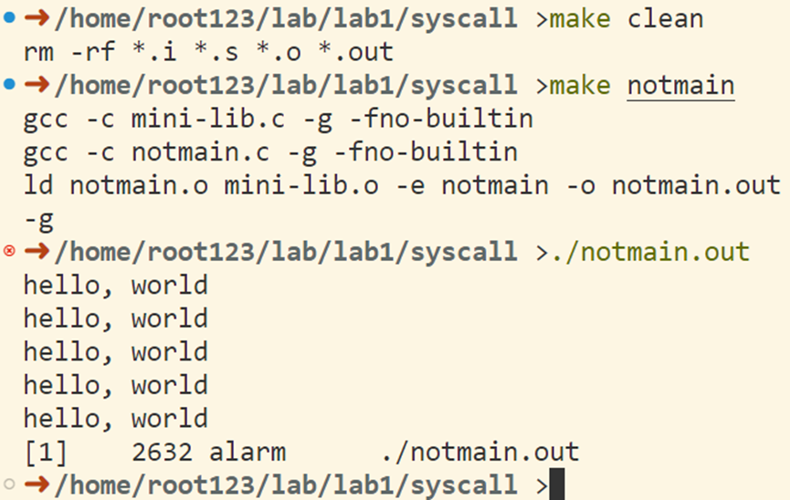
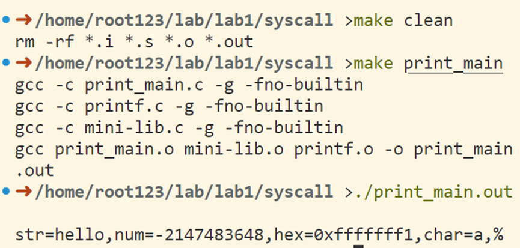
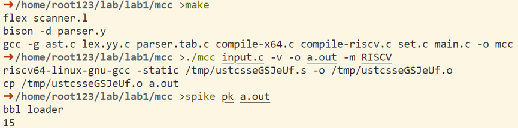

<h1 align = center> LAB1 实验报告</h1>

<div align = right>SA23225XXX 高XX</div>


## Part A: Libraries

### exit实现
```C
void exit(int status)
{
    // Your code here:
    // TODO();
    long r = status;
    asm(CALL(SYS_EXIT) "movq %0, %%rdi\n"
                       "syscall\n"
        :
        : "r"(r)
        : "%rax", "%rdi");
}
```
### alarm实现
```C
int alarm(unsigned int seconds)
{
    // Your code here:
    // TODO();
    long r;
    long sec = seconds;
    asm(CALL(SYS_ALARM) "movq %1, %%rdi\n"
                        "syscall\n"
                        "movq %%rax, %0\n"
        : "=r"(r)
        : "r"(sec)
        : "%rax", "%rdi");
    return (int)r;
}
```
### sleep实现
```C
int sleep(struct timespec *ts, struct timespec *rem)
{
    // Your code here:
    // TODO();
    long r;
    asm(CALL(SYS_SLEEP) "movq %1, %%rdi\n"
                        "movq %2, %%rsi\n"
                        "syscall\n"
                        "movq %%rax, %0\n"
        : "=r"(r)
        : "r"(ts), "r"(rem)
        : "%rax", "%rdi", "%rsi");
    return (int)r;
}
```
### printf实现
只实现了%s %d %x %c %%
```C
int hex2Str(unsigned int num, char *buffer, int count)
{
    char hex[16] = "0123456789abcdef";
    buffer[count++] = '0';
    buffer[count++] = 'x';
    if (num == 0)
    {
        buffer[count++] = '0';
        return count;
    }

    int k = 0, arr[32];
    while (num != 0)
    {
        arr[k++] = num & 0xf;
        num >>= 4;
    }

    for (int i = (k - 1); i >= 0; i--)
    {
        buffer[count++] = hex[arr[i]];
    }

    return count;
}

int dec2Str(int num, char *buffer, int count)
{
    if (num == 0)
    {
        buffer[count++] = '0';
        return count;
    }
    else if (num == (int)-2147483648)
    {
        const char *str = "-2147483648";
        while (*str != 0)
        {
            buffer[count++] = *str;
            str++;
        }
        return count;
    }
    else if (num < 0)
    {
        buffer[count++] = '-';
        num = -num;
    }
    int i = 0, arr[100];
    while (num != 0)
    {
        arr[i++] = num % 10;
        num /= 10;
    }

    char dec[10] = "0123456789";
    for (int j = i - 1; j >= 0; j--)
    {
        buffer[count++] = dec[arr[j]];
    }
    return count;
}
void print_buffer(int *ret, int *count, char *buffer)
{
    buffer[*count] = '\0';
    puts(buffer);
    *ret += *count;
    *count = 0;
}
#include <stdarg.h>
int printf(const char *format, ...)
{
    // Your code here:
    // TODO();
    const int MAX_BUFFER_SIZE = 1024;
    va_list ap;
    va_start(ap, format);
    int i = 0, ret = 0; // format index
    char buffer[MAX_BUFFER_SIZE + 100];
    int count = 0; // buffer index

    while (format[i] != '\0')
    {
        buffer[count++] = format[i];
        if (format[i] == '%')
        {
            count--;
            i++;
            switch (format[i])
            {
            case 'c':
                char character = va_arg(ap, int);
                buffer[count++] = character;
                break;
            case 's':
                print_buffer(&ret, &count, buffer);
                const char *string = va_arg(ap, char *);
                ret += strlen(string);
                puts(string);
                break;
            case 'x':
                unsigned int hexadecimal = va_arg(ap, unsigned int);
                count = hex2Str(hexadecimal, buffer, count);
                break;
            case 'd':
                int decimal = va_arg(ap, int);
                count = dec2Str(decimal, buffer, count);
                break;
            case '%':
                count++;
                break;
            }
        }
        if (count >= MAX_BUFFER_SIZE)
            print_buffer(&ret, &count, buffer);
        i++;
    }

    if (count != 0)
        print_buffer(&ret, &count, buffer);
    va_end(ap);

    return ret;
}
```

### 实验结果
#### notmain测试程序
```C
#include "mini-lib.h"

struct timespec ts = {.tv_sec = 1, .tv_nsec = 0};

int notmain(){
    alarm(5);

    for(;;) {
        puts("hello, world\n");
        sleep(&ts, 0);
    }

    exit(0);
}
```

#### print_main测试程序
```C
#include "mini-lib.h"

int main()
{
    printf("str=%s,num=%d,hex=%x,char=%c,%%\n", "hello", (int)-2147483648, 0xfffffff1, 'a');
    return 0;
}
```



## Part B: The mcc Compiler

### **Exercise 4**
各参数的作用如下。除了-S及-c无法组合使用外，其余各参数即可自由组合使用。
-o：指定生成文件的文件名
-S：指定模式为编译模式COMPILE，生成汇编代码文件（.s）
-c：指定模式为汇编模式ASSEMBLY，生成中间代码文件（.o）
-m：指定编译器后端架构，是X64还是RISCV，不指定则默认按照X64架构下进行编译和汇编
-v：在console中打印编译过程中的每一条cmd命令


### **Exercise 5**
#### How does mcc implement an assignment statement like a = a + 5.
当编译器解析到赋值语句a = a + 5时，节点的类型为STM_ASSIGN。编译器先将该节点强制类型转换为Stm_Assign类型，以获取赋值语句左值的变量名a和右值的表达式节点a+5。然后将变量名a添加到符号表中，递归解析表达式节点a+5，根据节点类型发射相应的汇编指令并将表达式a+5的计算结果存放在rax 寄存器中。最后，发射汇编指令movq a(%rip), %rax，将表达式计算结果从rax寄存器转移到变量a中。

#### What about an output statement print(a)?
当编译器解析到输出语句print(a)时，节点的类型为 STM_PRINT。编译器先将该节点强制类型转换为Stm_Print类型，以获取输出语句参数中的表达式节点a。然后递归解析表达式节点a，根据节点类型发射相应的汇编指令并将表达式a的计算结果存放在rax寄存器中。最后，发射汇编指令movq %rax, %rsi、leaq mcc_format(%rip), %rdi以及call printf，将printf函数的第一个参数（格式字符串”%d\n”）放置在rdi寄存器中，第二个参数（a）放置在rsi寄存器中，调用printf函数输出a的值。


### **Exercise 6**
#### 前期工作
首先编写程序hello.c
```C
#include <stdio.h>

int main()
{
    int a = 5;
    int b = a + 2 * 5;
    printf("%d\n", b);
    return 0;
}
```
执行命令`riscv64-linux-gnu-gcc -S hello.c -o helloRISCV.s`

得到helloRISCV.s的核心汇编代码如下：
```assembly
addi	s0,sp,32
li	a5,5
sw	a5,-24(s0)
lw	a5,-24(s0)
addiw	a5,a5,10
sw	a5,-20(s0)
lw	a5,-20(s0)
mv	a1,a5
lla	a0,.LC0
call	printf@plt
```
***可知printf函数调用方式为：将结果放置在a1寄存器，格式字符串的地址放置在a0寄存器，调用printf@plt。***

#### POP实现
```C
static void POP()
{
    // TODO
    stackoffset--;
    sprintf(instr, "\tlw\ta2, %d(sp)\n", 4 * stackoffset);
    emit(instr);
}
```
#### compile_exp实现
```C
static void compile_exp(Exp_t exp)
{
    switch (exp->type)
    {
    case EXP_NUM:
    {
        Exp_Num e = (Exp_Num)exp;
        sprintf(instr, "\tli\ta1, %d\n", e->num);
        emit(instr);
        break;
    }
    case EXP_VAR:
    {
        // TODO
        Exp_Var e = (Exp_Var)exp;
        sprintf(instr, "\tlw\ta1, %s\n", e->name);
        emit(instr);
        break;
    }
    case EXP_ADD:
    {
        Exp_Add e = (Exp_Add)exp;
        compile_exp(e->left);
        PUSH();
        compile_exp(e->right);
        POP();
        emit("\taddw\ta1, a2, a1\n");
        break;
    }
    case EXP_SUB:
    {
        // TODO
        Exp_Sub e = (Exp_Sub)exp;
        compile_exp(e->left);
        PUSH();
        compile_exp(e->right);
        POP();
        emit("\tsubw\ta1, a2, a1\n");
        break;
    }
    case EXP_TIMES:
    {
        // TODO
        Exp_Times e = (Exp_Times)exp;
        compile_exp(e->left);
        PUSH();
        compile_exp(e->right);
        POP();
        emit("\tmulw\ta1, a2, a1\n");
        break;
    }
    case EXP_DIV:
    {
        Exp_Div e = (Exp_Div)exp;
        compile_exp(e->left);
        PUSH();
        compile_exp(e->right);
        POP();
        emit("\tdivw\ta1, a2, a1\n");
        break;
    }
    default:
    {
        emit("\t# Unknown expression type\n");
        break;
    }
    }
}

```
#### compile_stm实现
```C
static void compile_stm(Stm_t stm)
{
    switch (stm->type)
    {
    case STM_ASSIGN:
    {
        Stm_Assign s = (Stm_Assign)stm;
        set_add(s->x);
        compile_exp(s->exp);
        sprintf(instr, "\tlla\ta3, %s\n", s->x);
        emit(instr);
        sprintf(instr, "\tsw\ta1, 0(a3)\n");
        emit(instr);
        break;
    }
    case STM_PRINT:
    {
        // TODO
        Stm_Print s = (Stm_Print)stm;
        compile_exp(s->exp);
        emit("\tlla a0, mcc_format\n"); // 格式
        emit("\tcall\tprintf@plt\n");
        break;
    }
    case CMD_SEQ: // 依次执行语句的序列
    {
        // TODO
        Stm_Seq s = (Stm_Seq)stm;
        compile_stm(s->left);
        compile_stm(s->right);
        break;
    }
    default:
    {
        emit("\t# Unknown statement type\n");
        break;
    }
    }
}

```

#### 实验结果
测试程序input.c
```
a = 5;
b = a + 2 * 5;
print(b)
```
