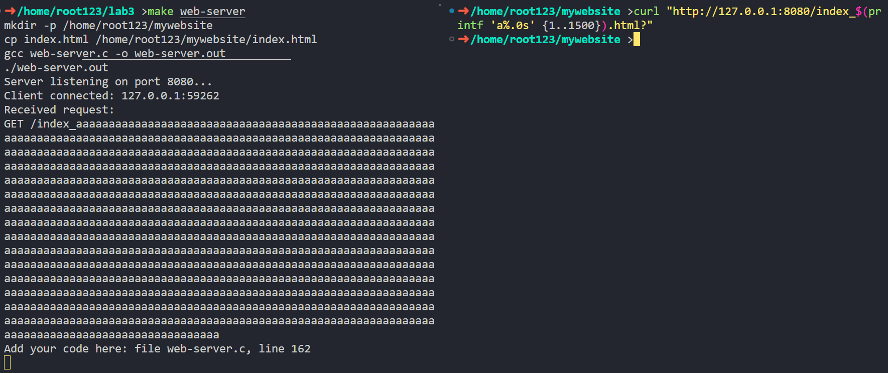

<h1 align = center> LAB3 实验报告</h1>

<div align = right>SA23225XXX 高XX</div>

## Part A: Web Server

### Square Server

#### Exercise 3

```C
// Exercise 3. Add your code:
// Add your code here:
buffer[received_bytes] = '\0';
if (strcmp(buffer, "bye") == 0)
{
    printf("Client %s:%d disconnected. Exiting...\n", client_ip, ntohs(client_addr.sin_port));
    break;
}
int num = atoi(buffer), square = num * num;
sprintf(buffer, "%d", square); // char \0 is ncluded
if (write(client_sock_fd, buffer, strlenbuffer)) < 0)
{
    perror("Write error or client disconnected");
    break;
}
// End of exercise 3
```

运行结果：


server 端代码见文件[./code/partA_server/square-server-exercise3.c](./code/partA_server/square-server-exercise3.c)，client 端见文件[./code/partA_server/square-client-tcp.c](./code/partA_server/square-client-tcp.c)
#### Exercise 4

自定义通信协议：

-   客户端发送字符`i`后接一个整数（以空格分割），服务器返回该整数的平方
-   客户端发送字符`f`后接一个浮点数（以空格分割），服务器返回该浮点数的平方
-   客户端发送 bye，服务器返回 bye，然后关闭连接

```C
// Exercise 4. Add your code:
// Add your code here:
buffer[received_bytes] = '\0';
if (strcmp(buffer, "bye") == 0)
{
    printf("Client %s:%d disconnected. Exiting...\n", client_ip, ntohs(client_addr.sin_port));
    break;
}
if (buffer[0] == 'i')
{
    int num = atoi(buffer + 2), square = num * num;
    sprintf(buffer, "%d", square); // char \0 is included
}
else if (buffer[0] == 'f')
{
    float num = atof(buffer + 2), square = num * num;
    sprintf(buffer, "%f", square);
}
else
{
    perror("Invalid input");
    break;
}
if (write(client_sock_fd, buffer, strlenbuffer)) < 0)
{
    perror("Write error or client disconnected");
    break;
}
// End of exercise 4
```

运行结果：


server 端代码见文件[./code/partA_server/square-server-exercise4.c](./code/partA_server/square-server-exercise4.c)，client 端见文件[./code/partA_server/square-client-tcp.c](./code/partA_server/square-client-tcp.c)

#### Challenge

以 exercise3 的任务为例，为了防止丢包，只是简单的 retry 是不够的，这可能会导致客户端收到错误的结果。以下例子可以说明：假设客户端发送数字`2`，服务端以`4`应答，但`TIMEOUT`后客户端没确认收到，于是服务端又发送了一遍`4`。但其实客户端已经收到了答案`4`，此时客户端发送数字`3`，然后收到了服务端上一次发来的`4`，于是客户端收到了错误的结果，误以为$3^2=4$。

因此，可以**在发送问题和应答时附上该次会话的`id`**，从而避免因 retry 造成的收到错误结果的问题。

在具体实现中：

-   id 从 0 开始自增
-   client 端`TIMEOUT`设为 3s，若超过此时间还未收到 server 端的响应则重传。
-   为确保实验现象正常，server 端发送消息前`sleep(4)`，从而人为制造阻塞。

实验结果如下：


可以看到，在引入消息 id 后，收到的结果可以保证正确。

server 端代码见文件[./code/partA_server/square-server.c](./code/partA_server/square-server.c)，client 端见文件[./code/partA_server/square-client.c](./code/partA_server/square-client.c)

### Web Server
我们需要对`web_root`以外的目录进行保护，防止GET或DELETE请求获取或删除不在本目录的文件。因此，我们需要对`fullpath`进行检查，如果`fullpath`不是以`web_root`开头，则返回 404或204。

```C
int is_in_web_root(const char *web_root, const char *file_path)
{
    // 获取file_path的绝对路径
    char *abs_file_path = realpath(file_path, NULL);

    if (abs_file_path == NULL)
    {
        // realpath函数解析失败，无法获取绝对路径
        perror("Failed to get absolute path");
        return 0;
    }

    // 检查abs_file_path是否以web_root开头
    int result = strncmp(web_root, abs_file_path, strlen(web_root)) == 0;
    free(abs_file_path);

    return result;
}
```
当然，也可以使用`chroot`：
```C
int main()
{
    // 切换根目录
    if (chroot(web_root) != 0) {
        perror("chroot");
        exit(EXIT_FAILURE);
    }
    // 切换当前工作目录
    if (chdir("/") != 0) {
        perror("chdir");
        exit(EXIT_FAILURE);
    }
    // 使用相对路径访问文件和目录
}
```

#### Exercise 5

```C
// Handle GET requests for serving files.
if (strcasecmp(method, "GET") == 0)
{
    // Exercise 5.
    // Add your code here:
    int file_fd = open(fullpath, O_RDONLY);
    char buf[BUF_SIZE];
    char response[BUF_SIZE], response_format[BUF_SIZE];
    if (file_fd < 0 || is_in_web_root(web_root, fullpath) == 0)
    {
        strcpy(buf, "<html><body><h1>404 Not Found</h1></body> </html>");
        strcpy(response_format, "HTTP/1.1 404 Not Found\r\nContent-Length: %d\r\n\r\n%s");
        sprintf(response, response_format, strlen(buf), buf);
    }
    else
    {
        strcpy(response_format, "HTTP/1.1 200 OK\r\nContent-Length: %d\r\n\r\n%s");
        int read_bytes = read(file_fd, buf, sizeof(buf));
        sprintf(response, response_format, read_bytes, buf);
    }
    write(client_sock, response, strlen(response));
    close(file_fd);
}
```

实验结果：


#### Exercise 6

```c
// Handle DELETE requests for deleting files.
else if (strcasecmp(method, "DELETE") == 0)
{
    // Exercise 6: Implement DELETE here
    // Add your code here:
    if (is_in_web_root(web_root, fullpath) == 0 || unlink(fullpath) < 0)
    {
        char response[] = "HTTP/1.1 204 No Content\r\nContent-Length: 0\r\n\r\n";
        write(client_sock, response, strlen(response));
    }
    else
    {
        static char message[] = "<html><body><h1>File deleted.</h1></body></html>";
        char response[BUF_SIZE];
        sprintf(response, "HTTP/1.1 202 Accepted\r\nContent-Length: %ld\r\n\r\n%s", strlen(message), message);
        write(client_sock, response, strlen(response));
    }
}
```

DELETE 方法删除 index.html 后：


再次请求，显示为 404 Not Found：


如果企图获取或删除不在本目录的文件，显示为 404或204：


#### Exercise 7

如图，`printf 'a%.0s' {1..1500}`表示打印 1500 个字符`a`，因此语句`curl "http://127.0.0.1:8080/index_$(printf 'a%.0s' {1..1500}).html?"`会请求一个文件名非常长的 html 资源。


输入`curl "http://127.0.0.1:8080/index_$(printf 'a%.0s' {1..1500}).html?"`后，服务器行为如下：



可以看到，由于`read`限制了读取字符的长度：

`char request[BUF_SIZE];`

`ssize_t bytes_received = read(client_sock, request, sizeof(request) - 1);`

因此服务器现将该申请资源的报文截断了。随后在解析过程中：

```C
char method[16], path[128];
int scanResult = sscanf(request, "%s %s", method, path);
printf("scanres: %d\n", scanResult);
printf("method: %s\n", method);
printf("path: %s\n", path);
```

由于 path 数组长度不足，发生溢出，`sscanf`发生未定义行为，结果如下：


为了抵御这一网络攻击，我们可以合理设置`request, method, path`数组的大小。在读取请求时，合适大小的`request`数组可以把过长的报文截断，合适大小的`method, path`数组可以防止`sscanf`发生未定义行为。

#### Challenge

父进程只负责`accept`及`waitpid`，每次收到新的连接请求后，将具体的`read`和`write`交由子进程处理：

```C
// Challenge: multiple process
// Add your code here:
pid_t pid = fork();
if (pid == 0)
{
    printf("Client connected: %s:%d\n", inet_ntoa(client_addr.sin_addr), ntohs(client_addr.sin_port));
    serve_client(client_sock, web_root); // serve client in child process
    exit(0);
}
else if (pid > 0)
{
    close(client_sock);         // close client socket in parent process
    waitpid(-1, NULL, WNOHANG); // avoid zombie process
}
else
{
    perror("fork");
}
```

实验结果如图：


可以看到，及时回收了子进程，避免了僵尸进程的产生。

<div STYLE="page-break-after: always;"></div>

## Part B: ICMP Tunneling

### ICMP Tunnel

#### Exercise 1: Do we need calculate the checksum field for the ICMP header? If so, what algorithm we should use?

需要，具体计算方法可参考[这篇文章](https://zhuanlan.zhihu.com/p/364195316)：

1. 将校验和字段设置为 0
2. 每 16 个 bit(即 2 个字节)组成一个数，相加。如果超过 16 个 bit，把超过的高位值加到这 16 个 bit 值上，得到的新值再和下一个值相加
3. 如果最后还剩 8 个 bit 值，不能简单的加到低位，要把这 8 个 bit 当成高位值，再用 0 填充一个 16 个 bit 值，相加
4. 最后取反，填充到校验和字段

```C
static unsigned short icmp_checksum(
                unsigned short *ptr, int nbytes) {
    long sum;
    unsigned short oddbyte;
    unsigned short answer;
    sum = 0;
    while (nbytes > 1) {
        sum += *ptr++;
        nbytes -= 2;
    }
    if (nbytes == 1) {
        oddbyte = 0;
        *((uint8_t *) &oddbyte) = *(uint8_t *)ptr;
        sum += oddbyte;
    }
    sum = (sum >> 16) + (sum & 0xffff);
    sum += (sum >> 16);
    answer = ~sum;
    return answer;
}
```

#### Exercise 2

```C
int senddata(char *data)
{
    // Exercise 2.
    // Add your code here:
    strcpy(tnel->data, data);

    // ICMP头、dname、sname必须全发完，data不必全发完
    total_len = sizeof(struct icmphdr) + sizeof(tnel->dname) + sizeof(tnel->sname) + strlen(data); // data发到'\0'即可

    // 装载ICMP头
    struct icmphdr *icmph = (struct icmphdr *)(sendbuff);
    // checksum置位0
    icmph->checksum = 0;
    // echo 请求包 type 字段为 8, code 字段为 0
    icmph->type = ICMP_ECHO;
    icmph->code = 0;
    // id, 可随机，范围: 0 ~ 65535
    // sequence, 可随机，范围: 0 ~ 65535
    icmph->un.echo.id = 0;
    icmph->un.echo.sequence = 0;
    icmph->checksum = icmp_checksum((unsigned short *)icmph, total_len);

    // 装载ICMP tunnel数据体
    memcpy(sendbuff + sizeof(struct icmphdr), tnel, total_len - sizeof(struct icmphdr));

    // 发送ICMP数据包，系统会自动填充IP头
    return sendto(socket_fd, sendbuff, total_len, 0, (struct sockaddr *)&dest_addr, sizeof(dest_addr));
}
```

有趣的现象：必须要使用`sudo`前缀，即 root 权限才能成功通信：

看来我们果然是在滥用 ICMP 协议，而且还是在 root 权限下才能滥用。

#### Challenge

加密算法如下（不含调试输出）：

```C
#define KEY "secretkey"
void encrypt()
{
    const int key_len = strlen(KEY);
    for (int i = 0; i < total_len; ++i)
    {
        sendbuff[i] = sendbuff[i] ^ KEY[i % key_len];
    }
}
void decrypt()
{
    struct iphdr *iph = (struct iphdr *)(recvbuff);
    const int key_len = strlen(KEY), ipheader_len = sizeof(struct iphdr), recv_len = ntohs(iph->tot_len);
    // printf("Let's decrypt! Received data: ");
    for (int i = ipheader_len; i < recv_len; ++i)
    {
        // 打印接收到的数据(密文)
        // if (recvbuff[i] >= 0x20 && recvbuff[i] <= 0x7E)
        //    printf("%c", recvbuff[i]);
        // else
        //    printf("X");

        recvbuff[i] = recvbuff[i] ^ KEY[(i - ipheader_len) % key_len];
    }
    // printf("\n");
}
```
上述算法充分利用了异或运算的性质，即`a ^ b ^ b = a`。值得一提的是，`recv_len = ntohs(iph->tot_len)`获取的是 IP 层头部传来的数据长度，而`iph->tot_len`是 IP 层头部中的数据长度字段，因此需要使用`ntohs`函数将其转换为主机字节序，否则就会出现错误的结果。

其中，`encrypt`在`senddata`函数内的`sendto`调用前调用。

```C
// 加密
encrypt();
// 发送ICMP数据包，系统会自动填充IP头
return sendto(socket_fd, sendbuff, total_len, 0,(struct sockaddr *)&dest_addr, sizeof(dest_addr));
```

而`decrypt`在`recvfrom`函数后调用，并且需要传入`recvfrom`的返回值`n`，否则不知道`recvbuff`的长度（必须通过系统解析 IP 层头部传来的长度字段才能知道）。

```C
recvfrom(socket_fd, recvbuff, BUFFSIZE, 0, NULL, NULL);
decrypt();
```

打开调试输出后，结果如下：

可以看到，由于加密后的数据包中含有非 ASCII 字符，因此无法正常显示（此时打印`X`）。而且我们能注意到密文中出现了两次`secretkey`的子串`cretkey`，这是因为`unsigned char sname[10],dname[10];`中只有前两个字符被初始化（`h1`和`h2`），后面的字符是`'\0'`，异或运算后字符保持不变，因此用此法加密后会出现`secretkey`的子串。

<div STYLE="page-break-after: always;"></div>

## Part C: Network Sniffing
做这个实验时vscode的C/C++辅助插件一直报错，解决方案可参考[这篇回答](https://piazza.com/class/lmlkp18x7x67bd/post/32)，在.vscode文件夹修改c_cpp_properties.json，在defines字段添加`"__linux__","__x86_64__","_GNU_SOURCE"`即可。
```json
{
    "configurations": [
        {
            "name": "Linux",
            "includePath": [
                "${default}"
            ],
            "defines": [
                "__linux__",
                "__x86_64__",
                "_GNU_SOURCE"
            ],
            "cStandard": "c17",
            "cppStandard": "gnu++17",
            "intelliSenseMode": "linux-gcc-x64"
        }
    ],
    "version": 4
}
```
### Promiscuous Mode
#### Exercise 1
做实验前首先查看网卡信息：


<div STYLE="page-break-after: always;"></div>

分别在lo及eth0上进行测试，结果如下：

lo


eth0


### Network Sniffing
#### Exercise 2
照着`ICMP_printer`依葫芦画瓢即可。需要注意的是ARP协议没有数据负载，因此无需打印数据负载。其他的协议都需要打印数据负载。
```C
// print ARP packet
void ARP_printer(unsigned char *buffer)
{
    printf("\n---------------------------ARP Packet---------------------------");
    // print header
    mac_header(buffer);
    arp_header(buffer);
    printf("--------------------------------------------------------------\n\n\n");
}
```
这里只贴出ARP协议的打印函数，其他协议的打印函数类似ICMP的处理，直接看文件[./code/partC_sniffing/packet-process.c](./code/partC_sniffing/packet-process.c)即可。
#### Exercise 3
判断协议类型的函数如下：
```C
bool filterByProtocol(unsigned char *buffer, int type)
{
    // Exercise 3: complete filter by MAC address, protocol type, and port number:
    // Add your code here:
    if (type < 1 || type > 4)
        return false;
    struct ethhdr *eth = (struct ethhdr *)(buffer);
    int eth_protocol = (int)ntohs(eth->h_proto), type2eth_protocol[5] = {0, ETHERTYPE_ARP, ETHERTYPE_IP, ETHERTYPE_IP, ETHERTYPE_IP};
    // 判断ARP和其他三个（均使用IP协议）
    if (eth_protocol != type2eth_protocol[type])
        return false;
    else
    {
        struct iphdr *ip = (struct iphdr *)(buffer + sizeof(struct ethhdr));
        // int8不用转网络字节序
        int ip_protocol = ip->protocol, type2ip_protocol[5] = {0, 0, IPPROTO_ICMP, IPPROTO_TCP, IPPROTO_UDP};
        // 判断ICMP/TCP/UDP
        if (ip_protocol != type2ip_protocol[type])
            return false;
        else
            return true;
    }
}
```
先判断type是否合法，然后判断以太网帧中的协议类型，最后判断IP数据报中的协议类型。

判断端口号的函数如下：
```C
bool filterByPort(unsigned char *buffer, unsigned short port, int type)
{
    // Exercise 3: complete filter by MAC address, protocol type, and port number:
    // Add your code here:
    if (type != 0 || type != 1)
        return false;
    struct ethhdr *eth = (struct ethhdr *)(buffer);
    // if the type of packet is not IP.
    if ((int)ntohs(eth->h_proto) != ETHERTYPE_IP)
    {
        return false;
    }
    struct iphdr *ip = (struct iphdr *)(buffer + sizeof(struct ethhdr));
    if (ip->protocol == IPPROTO_TCP)
    {
        struct tcphdr *tcp = (struct tcphdr *)(buffer + sizeof(struct ethhdr) + sizeof(struct iphdr));
        if (type == 0)
        {
            if (ntohs(tcp->source) == port)
                return true;
            else
                return false;
        }
        else
        {
            if (ntohs(tcp->dest) == port)
                return true;
            else
                return false;
        }
    }
    else if (ip->protocol == IPPROTO_UDP)
    {
        struct udphdr *udp = (struct udphdr *)(buffer + sizeof(struct ethhdr) + sizeof(struct iphdr));
        if (type == 0)
        {
            if (ntohs(udp->source) == port)
                return true;
            else
                return false;
        }
        else
        {
            if (ntohs(udp->dest) == port)
                return true;
            else
                return false;
        }
    }
    else
        return false;
}
```
先判断type是否合法，然后判断以太网帧中的协议类型，最后判断IP数据报中的协议类型。如果是TCP协议，判断源端口或目的端口是否与给定的端口号相同；如果是UDP协议，同理；两者都不是则不合法。

分别在lo及eth0上进行测试，结果如下：

lo


<div STYLE="page-break-after: always;"></div>

eth0


<div STYLE="page-break-after: always;"></div>

## Part D. Packet Spoofing
### ICMP forgery
原代码有bug，引入了两个不相容的头文件导致重定义了了一些结构体。

具体问题在于，原代码中引入了两个头文件`net/if.h`和`linux/icmp.h`，而后者引入了`linux/if.h`，导致出现了两份`if.h`文件。两者都提供了管理网络接口(interface)的数据结构。`linux/if.h` 特别与 Linux 内核的网络接口(interface)交互有关。`net/if.h` 是用于相同目的的 glibc 文件，最初更侧重于用户空间。

于是我修改了代码文件[./code/partD_spoofing/ICMP-forge.c](./code/partD_spoofing/ICMP-forge.c)。放弃引入了`net/if.h`。如图，成功伪造ICMP报文发送。

其他的代码页有类似问题，因此我都进行了相似的修改。

### ARP forgery
#### Exercise 4
用`ioctl(sock_raw, SIOCGIFHWADDR, &ifreq_c)`可以获得当前网卡的MAC地址，然后用`inet_addr(inet_ntoa((((struct sockaddr_in *)&(ifreq_arp.ifr_addr))->sin_addr)))`可以获取当前网卡配置的IP地址（当然这两个也可以随意伪造）

由于是ARP请求报文，因此目的MAC地址为全0，目的IP地址我填了WSL对应的windows主机的IP地址，即172.23.112.1。核心函数`get_arp`完整代码如下：
```C
void get_arp()
{
    struct ether_arp *arp = (struct ether_arp *)(sendbuff + sizeof(struct ethhdr));
    arp->ea_hdr.ar_hrd = htons(ARPHRD_ETHER);
    arp->ea_hdr.ar_pro = htons(ETH_P_IP);
    arp->ea_hdr.ar_hln = 6;
    arp->ea_hdr.ar_pln = 4;
    arp->ea_hdr.ar_op = htons(ARPOP_REQUEST); // ARP request

    memset(&ifreq_c, 0, sizeof(ifreq_c));
    // Replace eth0 with your network interface
    strncpy(ifreq_c.ifr_name, "eth0", IFNAMSIZ - 1);
    if ((ioctl(sock_raw, SIOCGIFHWADDR, &ifreq_c)) < 0)
        printf("error in SIOCGIFHWADDR ioctl reading");

    /* sender hardware address */
    memcpy(arp->arp_sha, &ifreq_c.ifr_hwaddr.sa_data, sizeof(arp->arp_sha));

    /* sender protocol address */
    in_addr_t spa = inet_addr(inet_ntoa((((struct sockaddr_in *)&(ifreq_arp.ifr_addr))->sin_addr)));
    memcpy(arp->arp_spa, &spa, sizeof(arp->arp_spa));

    /* target hardware address */
    // ARP request报文中，目的MAC地址的值为0
    memset(arp->arp_tha, 0, sizeof(arp->arp_tha));

    /* target protocol address */
    // 不妨让目的IP地址为 172.23.112.1，网络中以大端序存储
    // 因此高位字节存储在低地址，低位字节存储在高地址
    // 所以第一个字节为172，第二个字节为23，第三个字节为112，第四个字节为1
    arp->arp_tpa[0] = TPA0;
    arp->arp_tpa[1] = TPA1;
    arp->arp_tpa[2] = TPA2;
    arp->arp_tpa[3] = TPA3;
}
```

完整修改见代码文件[./code/partD_spoofing/ARP-forge.c](./code/partD_spoofing/ARP-forge.c)。

### UDP forgery
#### Exercise 5
字段check是校验和，但在UDP中不是强制的（仅限IPv4），因此可以简单置为零。随后再附加上数据部分即可。
```C
void get_udp()
{
    struct udphdr *uh = (struct udphdr *)(sendbuff + sizeof(struct iphdr) + sizeof(struct ethhdr));
    // Exercise 5: Write UDP_forge.c in your project to achieve the forgery of UDP protocol packets:
    // Add your code here:
    uh->source = htons(SRC_PORT);
    uh->dest = htons(DST_PORT);
    uh->len = htons(sizeof(struct udphdr));
    // 字段check是校验和，但在UDP中不是强制的（仅限IPv4），因此可以简单置为零
    uh->check = 0;
    total_len += sizeof(struct udphdr);
    get_data();
}
```

完整修改见代码文件[./code/partD_spoofing/UDP-forge.c](./code/partD_spoofing/UDP-forge.c)。

### TCP packet forgery
#### Challenge: Why forging valid TCP packets is challenging?
TCP 数据包有着许多复杂的字段，而且通常使用序列号和确认号来确保可靠的数据传输，相对于其他数据包，这一特性决定了黑客必须精心设计才能成功伪造数据包，但伪造一个SYN包便相对容易。
核心代码如下：
```C
struct dummy_tcphdr
{
    in_addr_t saddr;
    in_addr_t daddr;
    uint8_t zero;
    uint8_t protocol;
    uint16_t tcplen;
};
// 12字节的TCP伪首部
struct dummy_tcphdr *get_dummy_tcp(struct iphdr *iph)
{
    struct dummy_tcphdr *dummyhdr = (struct dummy_tcphdr *)malloc(sizeof(struct dummy_tcphdr));
    dummyhdr->saddr = iph->saddr;
    dummyhdr->daddr = iph->daddr;
    dummyhdr->zero = 0;
    dummyhdr->protocol = iph->protocol;
}
unsigned short tcp_checksum(unsigned short *ptr, int nbytes, unsigned short *dummyhdr)
{
    long sum;
    int dummyhdr_size = sizeof(struct dummy_tcphdr);
    while (dummyhdr_size != 0)
    {
        sum += *dummyhdr++;
        dummyhdr_size -= 2;
    }

    unsigned short oddbyte;
    unsigned short answer;
    sum = 0;
    while (nbytes > 1)
    {
        sum += *ptr++;
        nbytes -= 2;
    }
    if (nbytes == 1)
    {
        oddbyte = 0;
        *((uint8_t *)&oddbyte) = *(uint8_t *)ptr;
        sum += oddbyte;
    }
    sum = (sum >> 16) + (sum & 0xffff);
    sum += (sum >> 16);
    answer = ~sum;
    return answer;
}
void get_tcp(struct dummy_tcphdr *dummyhdr)
{
    struct tcphdr *th = (struct tcphdr *)(sendbuff + sizeof(struct iphdr) + sizeof(struct ethhdr));
    th->source = htons(SRC_PORT);
    th->dest = htons(DST_PORT);
    th->seq = htonl(114514);
    th->ack_seq = 0;
    th->doff = sizeof(struct tcphdr) / 4;
    th->fin = 0;
    th->syn = 1;
    th->rst = 0;
    th->psh = 0;
    th->ack = 0;
    th->urg = 0;
    th->window = htons(42);
    th->check = 0;
    th->urg_ptr = 0;
    th->res1 = th->res2 = 0;
    total_len += sizeof(struct tcphdr);
    int data_len = get_data();
    dummyhdr->tcplen = htons(sizeof(struct tcphdr) + data_len);
    th->check = htons(tcp_checksum((unsigned short *)(sendbuff + sizeof(struct iphdr) + sizeof(struct ethhdr)), sizeof(struct tcphdr) + data_len, (unsigned short *)dummyhdr));
}
```
完整代码见代码文件[./code/partD_spoofing/TCP-forge.](./code/partD_spoofing/TCP-forge.c)
