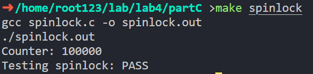
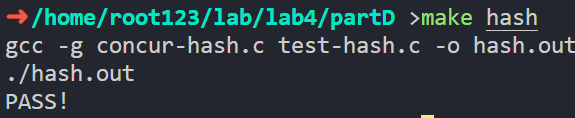

<h1 align=center>Lab 4: Concurrent Objects</h1>

<div align=right>SA23225XXX 高XX</div>

## Part A: Threads
### 1. Concurrency with Threads
#### Exercise 1
```C
for (long i = 0; i <= N; ++i)
{
    pthread_create(&tids[i], 0, start, (void *)i);
}
for (long i = 0; i <= N; ++i)
{
    void *res;
    pthread_join(tids[i], &res);
    sum += (long)res;
}
```


#### Exercise 2
可以看作是以(0.5,0.5)为圆心的一整个圆，或者是以(0,0)为圆心的四分之一圆，它们的面积都为$\pi/4$，所以$\pi=4*count/total$。

```C
void *start(void *__arg)
{
    struct arg_t *arg = (struct arg_t *)__arg;
    float x = arg->x, y = arg->y;
    long ret = (x * x + y * y <= 1);
    //((x - 0.5) * (x - 0.5) + (y - 0.5) * (y - 0.5) < 0.25);
    pthread_exit((void *)ret);
}
```
结果有所不同但差异不大，因为随机数的生成是随机的，所以每次运行的结果都不一样，但是随着运行次数的增加，结果会越来越接近$\pi$。


<div STYLE="page-break-after: always;"></div>


## Part B: Race Conditions and Synchronization
### 1. Race Conditions
#### Exercise 1
如图，输出完全无法预料，但（理论上）预期输出是0。
正是因为没有同步，所以两个线程的执行顺序是不确定的，它们共同读写同一个变量`count`（而未对其进行加锁保护），所以会出现不可预料的结果。


### 2. Protecting Data with Mutexes
#### Exercise 2
```C
void initialize_counter(struct counter_t *counter)
{
    pthread_mutex_init(&counter->counter_mutex, NULL);
    counter->counter = 0;
}

void *increment_count(void *arg)
{
    pthread_mutex_lock(&shared_counter.counter_mutex);
    for (int i = 0; i < NUM_ITERATIONS; i++)shared_counter.counter++;
    pthread_mutex_unlock(&shared_counter.counter_mutex);
    pthread_exit(0);
}

void *decrement_count(void *arg)
{
    pthread_mutex_lock(&shared_counter.counter_mutex);
    for (int i = 0; i < NUM_ITERATIONS; i++)shared_counter.counter--;
    pthread_mutex_unlock(&shared_counter.counter_mutex);
    pthread_exit(0);
}
```


### 3. SpinLocks
#### Exercise 3
```C
void initialize_counter(struct counter_t *counter)
{
    pthread_spin_init(&counter->spinlock, 0);
    counter->counter = 0;
}

void *increment_count(void *arg)
{
    pthread_spin_lock(&shared_data.spinlock);
    for (int i = 0; i < NUM_ITERATIONS; i++)shared_data.counter++;
    pthread_spin_unlock(&shared_data.spinlock);
    pthread_exit(0);
}

void *decrement_count(void *arg)
{
    pthread_spin_lock(&shared_data.spinlock);
    for (int i = 0; i < NUM_ITERATIONS; i++)shared_data.counter--;
    pthread_spin_unlock(&shared_data.spinlock);
    pthread_exit(0);
}
```


#### Exercise 4
`NUM_THREADS`设置为10，`NUM_ITERATIONS`设置为10000000时，结果如下：

纯粹以执行时间来看，`pthread_spin_lock`的效率要高于`pthread_mutex_lock`。

### 4. Conditional Variables
#### Exercise 5
```C
long production_id = 0;

void *producer(void *arg)
{
    while (1)
    {
        pthread_mutex_lock(&buffer.mutex);
        while ((buffer.write_index + 1) % N == buffer.read_index) // full
        {
            pthread_cond_wait(&buffer.cond_full, &buffer.mutex);
        }
        buffer.data[buffer.write_index] = production_id;
        printf("Producer. ID = %ld, position = %ld\n", production_id, buffer.write_index);
        buffer.write_index = (buffer.write_index + 1) % N;
        buffer.size++;
        production_id++;
        pthread_cond_signal(&buffer.cond_empty); // signal consumer
        pthread_mutex_unlock(&buffer.mutex);
    }
    pthread_exit(0);
}

void *consumer(void *arg)
{
    while (1)
    {
        pthread_mutex_lock(&buffer.mutex);
        while (buffer.write_index == buffer.read_index) // empty
        {
            pthread_cond_wait(&buffer.cond_empty, &buffer.mutex);
        }
        long consumption_id = buffer.data[buffer.read_index];
        printf("\tConsumer. ID = %ld, position = %ld\n", consumption_id, buffer.read_index);
        buffer.read_index = (buffer.read_index + 1) % N;
        buffer.size--;
        pthread_cond_signal(&buffer.cond_full); // signal producer
        pthread_mutex_unlock(&buffer.mutex);
    }
    pthread_exit(0);
}
```
结果如下：


<div STYLE="page-break-after: always;"></div>


## Part C: Synchronization Primitives
### 1. Atomic Variables
#### Exercise 1
```C
void *start(void *thr_data)
{
    for (int i = 0; i < 10000; ++i)
    {
        atomic_fetch_add(&acnt, 1); // Increment atomic variable
        cnt++;                      // Increment non-atomic variable
    }

    pthread_exit(NULL);
}
```
如图，非原子操作计数器的结果不一定是100000，因为`cnt++`不是原子操作，所以可能会出现多个线程同时读取`cnt`的值，然后同时对其进行加一，导致最终结果小于预期。


### 2: Build Synchronization Primitives with Atomic Variables
#### Exercise 2
##### Spinlock
可以使用`atomic_exchange`和`atomic_store`来实现自旋锁，`atomic_exchange`用于获取锁，`atomic_store`用于释放锁。

```C
typedef struct Spinlock_t
{
    atomic_int n;
} spinlock_t;

void spinlock_init(spinlock_t *lock)
{
    atomic_init(&lock->n, 0);
}

void spinlock_lock(spinlock_t *lock)
{
    // 原子替换obj指向的值desired并返回obj之前保存的值。
    while (atomic_exchange(&lock->n, 1))
    {
        // Spin until the lock is acquired
    }
}

void spinlock_unlock(spinlock_t *lock)
{
    atomic_store(&lock->n, 0);
}

typedef struct
{
    spinlock_t lock;
    int num;
} counter_t;

counter_t counter;

void *start()
{
    for (int i = 0; i < 10000; i++)
    {
        spinlock_lock(&counter.lock);
        counter.num++;
        spinlock_unlock(&counter.lock);
    }
    pthread_exit(0);
}
```
运行结果：


##### Semasphore
可以使用`atomic_load`、`atomic_compare_exchange_weak`和`atomic_fetch_add`来实现信号量机制，`atomic_load`和`atomic_compare_exchange_weak`用于P操作，`atomic_fetch_add`用于V操作。

P操作之所以不用`atomic_fetch_sub`，是因为`atomic_fetch_sub`只能完成单步减1的操作，而不能同时完成减1和判断是否已经重复减1的操作，所以需要使用`atomic_compare_exchange_weak`来完成。
```C
typedef struct {
    atomic_int value;
} sema_t;
void sema_init(sema_t *sem, int v)
{
    atomic_init(&sem->value, v);
}

void sema_wait(sema_t *sem)
{
    int expected, desired;
    do
    {
        while ((expected = atomic_load(&sem->value)) <= 0)
        {
            // busy-wait/spin until value is greater than 0
        }
        desired = expected - 1;
    } while (!atomic_compare_exchange_weak(&sem->value, &expected, desired));
    // 当前值与期望值(expect)相等时，修改当前值为设定值(desired)，返回true，跳出循环
    // 当前值与期望值不等时，将期望值修改为当前值，返回false，继续循环
}

void sema_post(sema_t *sem)
{
    atomic_fetch_add(&sem->value, 1);
}

typedef struct
{
    sema_t sem;
    int num;
} counter_t;

counter_t counter;

void *start(void *arg)
{
    for (int i = 0; i < 10000; i++)
    {
        sema_wait(&counter.sem);
        counter.num++;
        sema_post(&counter.sem);
    }
    pthread_exit(0);
}
```
运行结果：


<div STYLE="page-break-after: always;"></div>


### Part D: Concurrent Data Structures
### 1: Concurrent stack
#### Exercise 1
头插法：
```C
void concur_stack_push(concur_stack_t *stack, int value)
{
    pthread_mutex_lock(&stack->mu);
    node_t *new_node = (node_t *)malloc(sizeof(node_t));
    new_node->value = value;
    new_node->next = stack->top;
    stack->top = new_node;
    pthread_mutex_unlock(&stack->mu);
}

int concur_stack_pop(concur_stack_t *stack)
{
    int value = -1;

    if (stack->top)
    {
        pthread_mutex_lock(&stack->mu);
        node_t *head = stack->top;
        value = head->value;
        stack->top = head->next;
        free(head);
        pthread_mutex_unlock(&stack->mu);
    }

    return value;
}

int concur_stack_size(concur_stack_t *stack)
{
    int size = 0;
    pthread_mutex_lock(&stack->mu);
    node_t *cur = stack->top;
    while (cur)
    {
        ++size;
        cur = cur->next;
    }
    pthread_mutex_unlock(&stack->mu);
    return size;
}
```
运行结果：

### 2: Concurrency hash table
#### Exercise 2
```C
typedef struct Node_t {
    char *key;
    char *value;
    struct Node_t *next;
} node_t;

typedef struct Hash_t {
    pthread_mutex_t mu;
    node_t **buckets;
    int num_buckets;
} hash_t;

// hash
static unsigned int djb_hash(const char *cp)
{
    unsigned hash = 5381;
    while (*cp)
        hash = 33 * hash ^ (unsigned char)*cp++;
    return hash;
}

void hash_init(hash_t *ht, int num_buckets)
{
    pthread_mutex_init(&ht->mu, 0);
    ht->buckets = calloc(num_buckets, sizeof(*ht->buckets));
    // calloc() 函数将分配的内存全部初始化为零
    ht->num_buckets = num_buckets;
}

void hash_insert(hash_t *ht, char *key, char *value)
{
    pthread_mutex_lock(&ht->mu);
    int bucket_id = djb_hash(key) % ht->num_buckets;
    node_t *new_node = malloc(sizeof(node_t));
    new_node->key = strdup(key);
    new_node->value = strdup(value);
    // 头插法
    new_node->next = ht->buckets[bucket_id];
    ht->buckets[bucket_id] = new_node;
    pthread_mutex_unlock(&ht->mu);
}

char *hash_lookup(hash_t *ht, char *key)
{
    pthread_mutex_lock(&ht->mu);
    int bucket_id = djb_hash(key) % ht->num_buckets;
    node_t *node = ht->buckets[bucket_id];
    while (node != NULL)
    {
        if (strcmp(node->key, key) == 0)
        {
            pthread_mutex_unlock(&ht->mu);
            return node->value;
        }
        node = node->next;
    }
    pthread_mutex_unlock(&ht->mu);
    return NULL;
}

// return 0 for success; 1 for non-exiting "key"
int hash_delete(hash_t *ht, char *key)
{
    pthread_mutex_lock(&ht->mu);
    int bucket_id = djb_hash(key) % ht->num_buckets;
    node_t *cur = ht->buckets[bucket_id];
    node_t *prev = NULL;
    while (cur != NULL)
    {
        if (strcmp(cur->key, key) == 0)
        {
            if (prev == NULL)
            {
                ht->buckets[bucket_id] = cur->next;
            }
            else
            {
                prev->next = cur->next;
            }
            free(cur->key);
            free(cur->value);
            free(cur);
            pthread_mutex_unlock(&ht->mu);
            return 0;
        }
        prev = cur;
        cur = cur->next;
    }
    return 1;
}

int hash_size(hash_t *ht)
{
    int size = 0;
    pthread_mutex_lock(&ht->mu);
    for (int i = 0; i < ht->num_buckets; i++)
    {
        node_t *node = ht->buckets[i];
        while (node != NULL)
        {
            size++;
            node = node->next;
        }
    }
    pthread_mutex_unlock(&ht->mu);
    return size;
}
```
运行结果：


代码见`concur-hash coarse-gained.c`及`concur-hash coarse-gained.h`
#### Challenge
为了实现更加细粒度的并发控制，我们对hash表的每个桶使用读写锁来实现细粒度的并发控制，读写锁允许多个线程同时读取数据，但是只允许一个线程写入数据。
- 如果一个线程获取了读锁	其它线程只能获取读取
- 如果一个线程获取了读锁	其它线程不能获取写锁
- 如果一个线程获取了写锁	其它线程什么也获取不到
```C
typedef struct Node_t
{
    char *key;
    char *value;
    struct Node_t *next;
} node_t;

typedef struct Hash_t
{
    int num_buckets;
    // 以下成员都是长为num_buckets的数组指针
    node_t **buckets;
    pthread_rwlock_t *mu;
} hash_t;

static unsigned int djb_hash(const char *cp)
{
    unsigned hash = 5381;
    while (*cp)
        hash = 33 * hash ^ (unsigned char)*cp++;
    return hash;
}

void hash_init(hash_t *ht, int num_buckets)
{
    ht->mu = calloc(num_buckets, sizeof(*ht->mu));
    ht->buckets = calloc(num_buckets, sizeof(*ht->buckets));
    ht->num_buckets = num_buckets;
}

void hash_insert(hash_t *ht, char *key, char *value)
{
    int bucket_id = djb_hash(key) % ht->num_buckets;
    node_t *new_node = malloc(sizeof(node_t));
    new_node->key = strdup(key);
    new_node->value = strdup(value);

    pthread_rwlock_wrlock(&ht->mu[bucket_id]);
    new_node->next = ht->buckets[bucket_id];
    ht->buckets[bucket_id] = new_node;
    pthread_rwlock_unlock(&ht->mu[bucket_id]);
}

char *hash_lookup(hash_t *ht, char *key)
{
    int bucket_id = djb_hash(key) % ht->num_buckets;
    pthread_rwlock_rdlock(&ht->mu[bucket_id]);
    node_t *node = ht->buckets[bucket_id];
    while (node != NULL)
    {
        if (strcmp(node->key, key) == 0)
        {
            pthread_rwlock_unlock(&ht->mu[bucket_id]);
            return node->value;
        }
        node = node->next;
    }
    pthread_rwlock_unlock(&ht->mu[bucket_id]);
    return NULL;
}

// return 0 for success; 1 for non-exiting "key"
int hash_delete(hash_t *ht, char *key)
{
    int bucket_id = djb_hash(key) % ht->num_buckets;
    node_t *prev = NULL;
    pthread_rwlock_wrlock(&ht->mu[bucket_id]);
    node_t *cur = ht->buckets[bucket_id];
    while (cur != NULL)
    {
        if (strcmp(cur->key, key) == 0)
        {
            if (prev == NULL)
            {
                ht->buckets[bucket_id] = cur->next;
            }
            else
            {
                prev->next = cur->next;
            }
            free(cur->key);
            free(cur->value);
            free(cur);
            pthread_rwlock_unlock(&ht->mu[bucket_id]);
            return 0;
        }
        prev = cur;
        cur = cur->next;
    }
    pthread_rwlock_unlock(&ht->mu[bucket_id]);
    return 1;
}

int hash_size(hash_t *ht)
{
    int size = 0;
    for (int i = 0; i < ht->num_buckets; i++)
    {
        pthread_rwlock_rdlock(&ht->mu[i]);
        node_t *node = ht->buckets[i];
        while (node != NULL)
        {
            size++;
            node = node->next;
        }
        pthread_rwlock_unlock(&ht->mu[i]);
    }
    return size;
}
```
代码见`concur-hash.c`及`concur-hash.h`

运行结果：


<div STYLE="page-break-after: always;"></div>


## Part E: Lock-free Data Structures
### 1: Lock-free stacks
#### Exercise 1
实现代码如下。需要提及的是，`lf_stack_size`函数没有考虑线程安全，因为在多线程环境下，`lf_stack_size`函数的返回值可能是不准确的，因为在计算size的过程中，可能有其他线程对栈进行了push或者pop操作。如果要实现线程安全的`lf_stack_size`函数，需要加锁。或者修改头文件，在`lf_stack_t`结构体中添加一个`size`成员，每次push或者pop操作时，对`size`进行原子操作。但这样的话性能会有所下降，无锁实现的意义也就不大了。
```C
typedef struct Node_t{
    int value;
    struct Node_t *next;
} Node_t;

typedef _Atomic(Node_t *) atomic_node;

typedef struct Lf_stack_t{
    atomic_node top;
} lf_stack_t;

void lf_stack_init(lf_stack_t *stack)
{
    atomic_store(&stack->top, 0);
    return;
}
// The key idea to build a lock-free stack is to compare and swap the stack top atomically.
void lf_stack_push(lf_stack_t *stack, int value)
{
    Node_t *new_node = (Node_t *)malloc(sizeof(Node_t));
    new_node->value = value;
    new_node->next = stack->top;

    // 当前值(stack->top)与期望值(expect)相等时，修改当前值为设定值(desired)，返回true，跳出循环
    // 当前值与期望值不等时，将期望值修改为当前值，返回false，继续循环
    while (!atomic_compare_exchange_weak(&stack->top, &new_node->next, new_node))
        ;
}

int lf_stack_pop(lf_stack_t *stack)
{
    Node_t *pop_node = stack->top;
    while (pop_node && !atomic_compare_exchange_weak(&stack->top, &pop_node, pop_node->next))
        ;
    if (!pop_node) // stack is empty
        return 0;
    int value = pop_node->value;
    free(pop_node);
    return value;
}

int lf_stack_size(lf_stack_t *stack)
{
    int count = 0;
    Node_t *node = stack->top;
    while (node)
    {
        count++;
        node = node->next;
    }
    return count;
}
```
运行结果：

### 2: Lock-free queues
#### Exercise 2
```C

typedef struct Node_t{
    int value;
    struct Node_t *next;
} node_t;

typedef _Atomic(node_t *) atomic_node;

typedef struct Lf_queue_t{
    atomic_node front;
    atomic_node rear;
} lf_queue_t;


void lf_queue_init(lf_queue_t *queue)
{
    node_t *node = (node_t *)calloc(1, sizeof(*node));
    atomic_store(&queue->front, node);
    atomic_store(&queue->rear, node);
    return;
}

void lf_queue_enqueue(lf_queue_t *queue, int value)
{
    node_t *new_node = (node_t *)malloc(sizeof(node_t));
    new_node->value = value;
    new_node->next = NULL;
    node_t *prev = atomic_exchange(&queue->rear, new_node);
    prev->next = new_node; // 最后再设置prev的next，保证prev的next不会被其他线程修改
    return;
}

int lf_queue_dequeue(lf_queue_t *queue)
{
    node_t *next;
    atomic_node head = queue->front;
    do
    {
        // 出队的时候最后剩下的是最后一次入队的节点
        next = head->next;
        if (next == NULL)
            return -1;
        // 比较head指针是否是我们之前获取的，成功则设置next，失败则自旋
    } while (!atomic_compare_exchange_weak(&queue->front, &head, next));
    free(head); // 释放dummy节点，此后出队的节点被视为dummy节点
    return next->value;
}

int lf_queue_size(lf_queue_t *queue)
{
    int size = 0;
    node_t *cur = atomic_load(&queue->front);
    while (cur != atomic_load(&queue->rear))
    {
        cur = cur->next;
        ++size;
    }
    return size;
}
```
