<h1 align=center>Lab 5: MapReduce</h1>

<div align=right>SA23225XXX 高XX</div>

因为该实验的实验代码过多，即使只贴核心代码，也会导致报告过长。因此我将实验代码放在了[code](./code)文件夹中，报告中一行代码不贴，形成了这份无代码版实验报告。

# 写在开头
作为一个此前对go语言和MapReduce完全无知的学生，本次lab共花费了我**超过40小时**的时间，花费的时间是lab1~4的总和。Debug时我数次熬夜，中途无数次地想过要不就此放弃，改做一个不限题材字数的报告水水过去算了。但最后我还是坚持了下来，终于保质保量地完成了所有exercise。

**请务必耐心看完，我拼上性命写完的报告。向这学习曲线极为陡峭的lab5，献上我全部的爱。**


# Part A: RPC
Part A非常简单，补充C语言核心代码即可，总共花费1h不到。但最重要的是，我们可以从这个Part的代码中学到很多关于gRPC和cgo的知识，这对之后的实验尤为重要。
## Services and RPCs
### Exercise 1
见`square-server.c`。
实验结果如下：

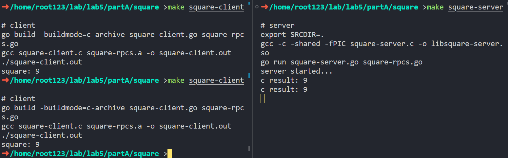

### Exercise 2
见`square-server.c`。
实验结果如下：

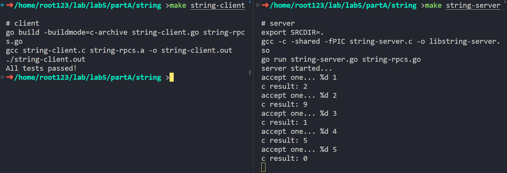

### Exercise 3
非并发栈实现见 `stack-server.c`。
实验结果如下：

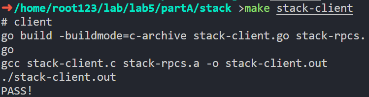

## Concurrency and Locks
### Exercise 1
实验结果如下：

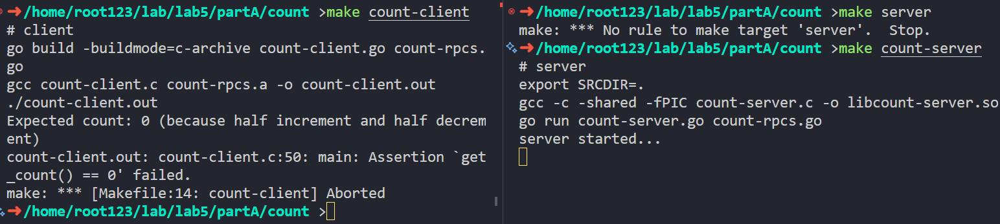

期望结果应为`get_count=0`。由于客户端起了多个线程并发访问服务端程序，而服务端程序中的`count`变量没有加锁，因此会出现多个线程通过RPC同时访问`count`变量的情况，导致`get_count`的值不为0。
### Exercise 2
见`count-server.c`。
实验结果如下：

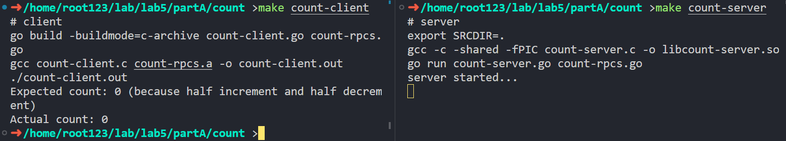
### Exercise 3
并发栈实现见`stack-server.c`。
实验结果如下：

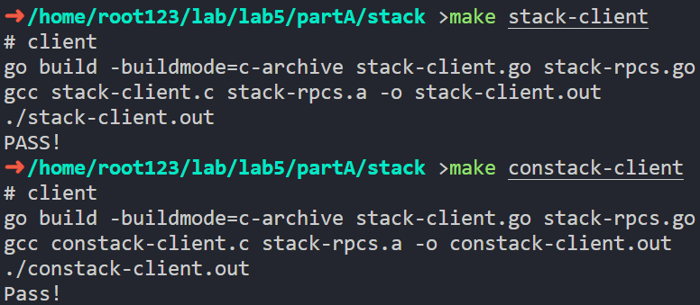

<div STYLE="page-break-after: always;"></div>


# Part B: MapReduce
Part B的实验内容非常丰富，包含了**顺序MapReduce**、**并发MapReduce**、**分布式MapReduce**三个部分，相比于Part A难度暴增，这三个部分的难度也呈指数上升。这里我将分三部分详细介绍我的实现过程。

首先利用`python3 generate-words.py 10 1M`生成数据集，其中`10`为文件数量，`1M`为数据集大小。存储在`./data`文件夹中，文件名为`a.txt`，`b.txt`，`c.txt`，`d.txt`，`e.txt`，`f.txt`，`g.txt`，`h.txt`，`i.txt`，`j.txt`。

## Sequential MapReduce
为了完成这个实验，我首先去看了Google的MapReduce论文，并在网上找到了它的java实现，初步建立了对MapReduce过程的基本认知。*（花费时间：3h）*

随后，我认真阅读了示例代码，弄清楚了示例代码中`file-struct`、`list`和`hash-table`等模块的实现逻辑。*（花费时间：1h）*

最后，我开始着手实现MapReduce的过程。由于这个实验的代码结构非常复杂，这里只贴出最重要的代码，完整代码请见[code/partB/sequential-mr](./code/partB/sequential-mr)。*（花费时间：1h）*

### Exercise 1
首先修改Makefile：

如上所示，因为**reduce过程需要使用哈希表**（位于lib文件夹，LAB4里的实现的数据结构）。同时，我们在Makefile里指定运行时参数，以方便调试。此后的**所有实验均需修改makefile**，而不能简单使用给定的makefile，但一一说明过于繁琐，因此此后不再赘述。

然后我们实现`map_phase`函数。


`map_phase`函数流程：首先遍历每个输入文件，读取文件内容，然后调用`mr_map`函数，统计词频，得到`cur_kv_list`。然后遍历`cur_kv_list`，对于每个键值对，计算哈希值，映射到对应的输出文件，然后将键值对写入临时文件。

然后我们实现`reduce_phase`函数。


`reduce_phase`函数流程：首先遍历每个输出文件，然后遍历相对应的输入文件，读取临时文件内容。遍历输入的每一行，将键值对插入哈希表。最后遍历哈希表，将键值对写入文件。

`map`得到`nInput*nOutput`个文件：

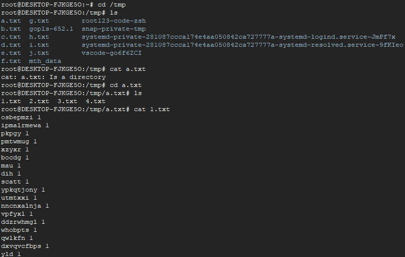

`reduce`得到4个文件，分别为`1.txt`，`2.txt`，`3.txt`，`4.txt`，内容如下：

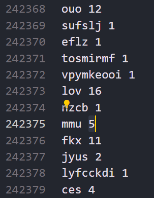

运行结果如下：

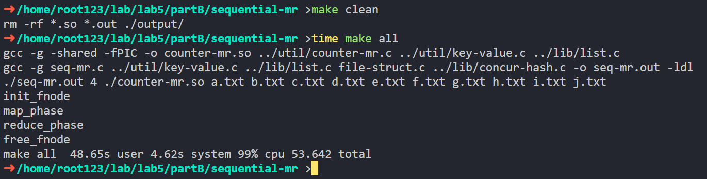


<div STYLE="page-break-after: always;"></div>


## Concurrent MapReduce

### Exercise 2
这个实验几乎没有给任何框架代码，自由度极高。因此，我决定采用`nInput`个线程来并发执行`map_phase`，然后采用`nOutput`个线程来并发执行`reduce_phase`。这样做的好处是，**可以充分利用多核CPU的优势**，同时**减少线程间的竞争**。

我原以为这样进行并发控制可以使得这个实验很简单，但实际上我遇到了很多问题。例如，**多线程下的`strtok`函数和哈希表会出现问题**，因此我不得不改用`concur-hash`，并在每个桶的`pthread_rwlock`的调试上花费了大量时间。*（花费时间：3h）*

**使用`strtok_r`来保证线程安全**是因为`strtok`会用全局变量来保存上一次调用的位置，因此在多线程环境下会出现问题。

与Exercise 1一样，我们依旧需要修改Makefile，因为**reduce过程需要使用哈希表**，因此需要编译`concur-hash.c`（位于lib文件夹，为LAB4里的实现的数据结构，利用**读写锁对每个桶进行细粒度的并发控制**）。我们采用Exercise 1里写好的`file-struct`框架，因此需要编译`file-struct.c`。同时，我们在Makefile里指定运行时参数。

运行结果如下：

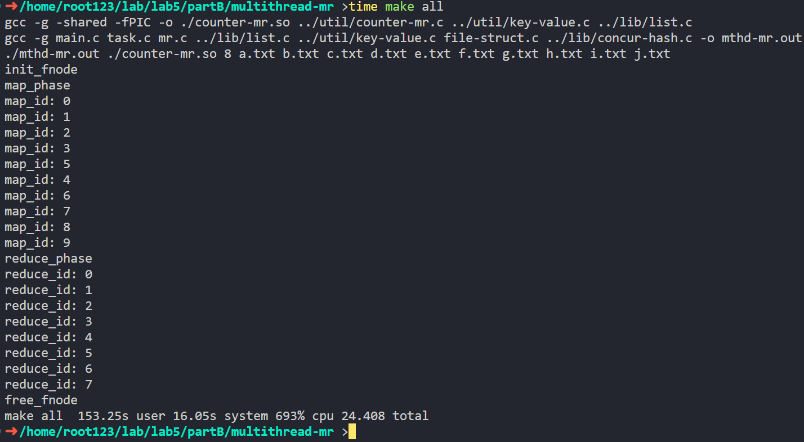
可以看到，性能相比Exercise 1有了明显的提升。生成的文件格式与Exercise 1相同，内容不再赘述。

<div STYLE="page-break-after: always;"></div>

## Distributed MapReduce
### Exercise 3
**对于无go语言基础的我，该Exercise共花费至少20h，因此在此我将详细记述我的这段经历**

首先，看到这个Exercise，我完全是一脸懵逼的。这个Exercise没有任何C语言的接口定义和说明。每个接口的输入输出、实现功能是什么？我不知道。我能看到的只有go语言的接口调用，但我对go语言一无所知，完全不知道该怎么实现啊……而且有些接口的返回值是什么意思我也不知道啊……当我看到有一个接口写死必须返回“finish”这种情况时，我的心情是崩溃的……

没办法，为了完成这个Exercise，我决定先学习go语言的基础知识，然后再来完成这个Exercise。所以，我首先在wsl上部署了[gotour](tour.go-zh.org)，然后开始从零学习go语言。我发现go语言的语法和C语言有很多相似之处，因此学的还算比较快。_（花费时间：10h）_

学习了一天掌握了基本语法后，我逐渐能看懂给的go例程了，也大概明白要在C语言上实现哪些接口了。我做的第一件事是看懂并修改go例程和makefile。将序列化反序列化逻辑移到C语言实现，以简化接口定义（这样接口定义就只是一个简单的`char*`而非自定义结构体接口了）为了完成这一步，我们至少要学会使用go的strings包。_（花费时间：1h）_

接着，先用C语言写一个序列化反序列化逻辑，把worker和master的消息传递模块先跑通，防止在这一步出现bug（在单个.c文件里面跑通就行）。_（花费时间：1h）_

随后，我先写了server端，把要MapReduce的文件列表相互传输（这里一定要注意go代码里的逻辑，`map_name`和`reduce_name`必须要在文件列表的第一个）。然后写一个Task调度器，决定client的动作（我实现的很简单，只有MAP/REDUCE/WAIT/FINISH这四个动作，而且map做完才给做reduce）

server端很容易出现bug，因为**必须考虑线程安全**。例如`strtok`函数就不能用，而要改用`strtok_r`，所用的哈希表也要考虑线程安全。我在这里花费了很多时间，绝大部分花在查看打印日志上。_（花费时间：6h）_

最后再写client端C代码，为了模拟race condition开多线程。根据server的task反馈决定完成MAP/REDUCE/WAIT/FINISH动作。client端的MAP/REDUCE代码可以抄前面实现的代码。_（花费时间：2h）_

最后呈现出的效果如下：
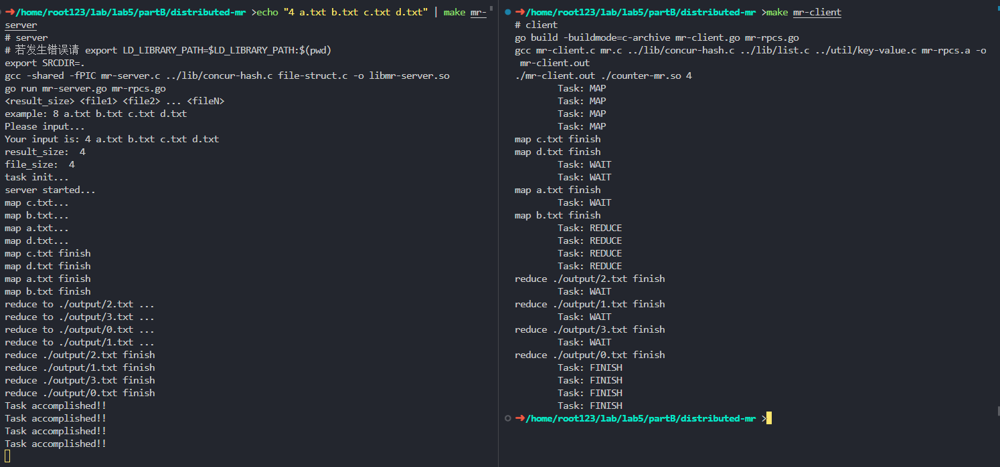

<div STYLE="page-break-after: always;"></div>

该实验的代码结构非常复杂，这里只贴出最重要的代码，完整代码请见[code/partB/distributed-mr](./code/partB/distributed-mr)。

首先，修改go代码。这是因为传输过来的已经是序列化后的字符串了，不需要再序列化。

然后，定义C的接口以及Task数据结构（mr-server.h）。
我们继续沿用Exercise 2里的Task数据结构，只是增加了一些哈希表来管理任务状态。
在这里，由于map和reduce得到的文件路径由client指定，因此`init_fnode`函数需要修改，将`create_files`函数注释掉，防止其创建文件。

哈希表管理任务状态的逻辑如下：
- 如果`map_waiting`里有任务，就从`map_waiting`里取出一个任务，然后放入`map_working`里，然后令worker执行MAP操作。
- MAP操作完成后，如果`map_working`里的任务全部做完，就填充`result_size`个任务进入`reduce_waiting`。
- 如果`reduce_waiting`里有任务，从`reduce_waiting`里取出一个任务，然后放入`reduce_working`里，然后令worker执行REDUCE操作。
- REDUCE操作完成后，如果`reduce_working`里的任务全部做完，标记task完成。此后只会向worker返回FINISH。
- 除此以外，返回WAIT。（例如`map_waiting`空而`map_working`不为空、`reduce_waiting`空而`reduce_working`不为空）

基于此，我们将上述接口一一实现（mr-server.c）。

随后，我们转战client端，实现worker的逻辑（mr-client.c）。

最后是MapReduce的核心逻辑（mr.c）。

<div STYLE="page-break-after: always;"></div>

# Part C: Sharded KV Stores
## Sharded KV Stores
### Exercise 1
例程代码已经实现了Exercise 1中的configuration模块，我们只需在每次进行`get`,`delete`,`put`前计算对应的`address`，并调用`Config_IP(address)`变更要发送请求的RPC地址即可。因此这个exercise主要是看懂示例代码，总共花费1h不到。
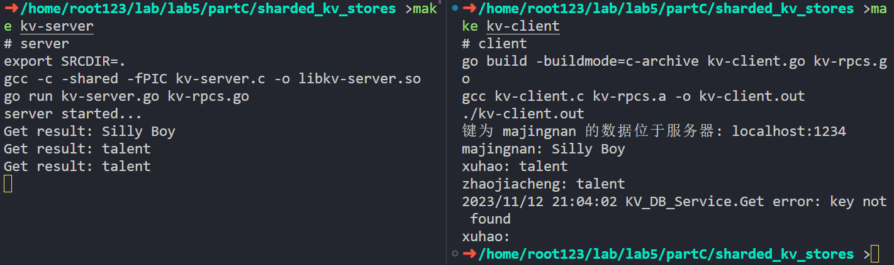

### Exercise 2
例程已经为我们实现了单值情形的k-v映射，因此只需实现`append`，并修改`get`,`delete`,`put`。*（花费时间：1h）*

首先修改.go文件，添加如下代码（要实现的`append`接口）

然后修改`kv-server.c`文件即可（此处使用了PartB里的list.c）


本地测试：
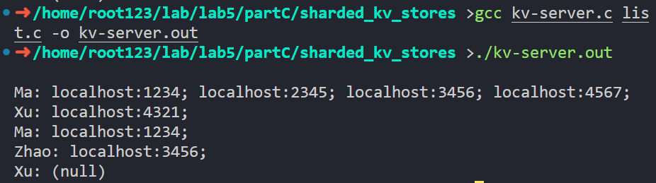

RPC测试：
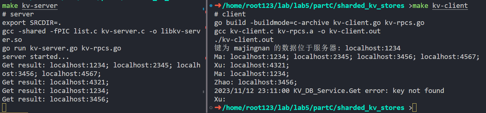
可以看出，RPC测试的结果和本地测试的结果一致。

## Sharding Master
实验做到这里我又一次陷入了困境。我一看完全没有示例代码，下载下来的code压缩包里就没有这个文件夹！看到这种情况我是真破防了，怎么连框架代码都没给啊？我该怎么实现这个Exercise？

这是继Distributed MapReduce实验后我离放弃最接近的一次。当我真的想要放弃时，我的心里流露出的是一种不甘。我花了这么多时间学习go语言，学习gRPC和cgo，学习C语言的线程安全，难道就这样放弃了吗？我不甘心啊！

于是我决定新建文件夹，从零开始实现。自己鼓捣一个框架出来，然后再实现这个Exercise。_（花费时间：4h）_

### Exercise 3/4
首先是go文件。我们可以复用Exercise1/2里面建立连接相关的代码，然后添加如下代码，完成三个接口设计。
- `master-rpcs.go`
- `master-client.go`
- `master-server.go`

接着继续复用configuration的数据结构定义，并为其实现序列化、反序列化逻辑。（继续利用读写锁`pthread_rwlock_t`进行并发控制）
- `configuration.h`
- `configuration.c`


最后实现RPC接口`master-server.c`。

需要注意的是读写锁的使用，以及`update_index`函数的实现。

测试时，依次执行`AddServer("localhost:2345");AddServer("localhost:2345");AddServer("localhost:5678");RemoveServer("localhost:2345");RemoveServer("localhost:2345");`，执行前后均调用`GetConfig()`查看结果。预期应有两次失败，无法重复添加和删除。

测试结果如图所示：
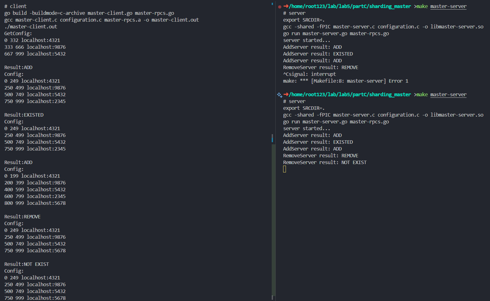
可以看出，测试结果和预期一致。

测试代码如`master-client.c`。

<div STYLE="page-break-after: always;"></div>

## KV Shuffling
难度最高的一个实验，光是框架和接口设计就花费了我几个小时，编码和调试加起来更是花费了我近10小时的时间。这个实验的难度在于，完全没有示例代码，所有框架和接口都需要自己摸索，调试还极为复杂（往往要开5、6个终端联调），而且需要同时考虑多个服务器以及多个客户端的并发问题。

### Exercise 5
由于这个任务比较复杂，代码量极多，因此此处只会贴出C文件的核心代码。go文件的代码只是简单的RPC接口实现，不再贴出，完整代码请参考[code/partC/kv_shuffling](./code/partC/kv_shuffling)。

#### 任务分配
我将该任务分成四个模块。约定好接口后，四个模块互相独立、互不影响，可以并行开发。
- **master-server**：负责管理kv存储服务器的配置文件和kv对的分配。（KV_MS_Service文件夹）
- **kv-server**：负责存储和传输kv对。（KV_DB_Service文件夹）
- **kv-client**：向kv存储服务器发送请求，生成、修改和获取数据。（Client文件夹）
- **manager**：负责与**master-server**及**kv-server**通讯，管理kv存储服务器的增减，以及kv对的实际分配。KV Shuffling的核心逻辑在这里实现。实际实现中，为了方便调试，manager也集成了**kv-client**的功能。（Manager文件夹）

完整的文件结构如图所示：
```
kv_shuffling
├── Client
│   ├── kv-client.c
│   ├── kv-client.go
│   ├── kv-rpcs.a
│   └── kv-rpcs.h
├── KV_DB_Service
│   ├── kv-server.c
│   ├── kv-server.go
│   ├── kv-server.h
│   └── libkv-server.so
├── KV_MS_Service
│   ├── libmaster-server.so
│   ├── master-server.c
│   ├── master-server.go
│   └── master-server.h
├── Manager
│   ├── manager.c
│   ├── master-client.c
│   ├── master-client.go
│   ├── master-client.h
│   ├── master-rpcs.a
│   └── master-rpcs.h
├── util
│   ├── kv-rpcs.go
│   └── master-rpcs.go
└── util_c
    ├── configuration.c
    ├── configuration.h
    ├── hash-table.c
    └── hash-table.h
```


#### master-server
首先我们可以复用Exercise 3/4里的**master-server**。只需修改少量go代码和C代码，完成对接。

#### kv-client
继续复用Exercise 1里的**kv-client**。只需修改少量go代码和C代码，补充`GetConfig`, `deserialize_config`, `getServerAddress`接口即可。


#### kv-server
然后，我们用go语言实现一个可以自由增减kv存储服务器（用协程实现）的kv存储系统**kv-server**。

并补充两个接口：`delete_kv_range`和`get_all_kv`，用于向manager传输kv对。


我们使用Exercise 1里的示例程序，增加、减少kv存储服务器后，执行结果如下：
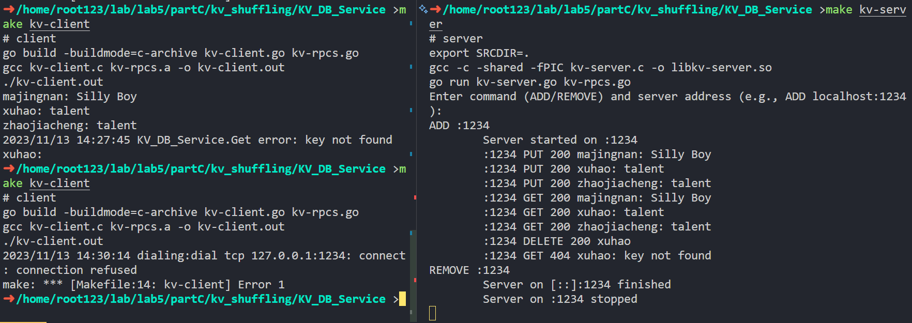

在多个服务器上尝试结果如下：
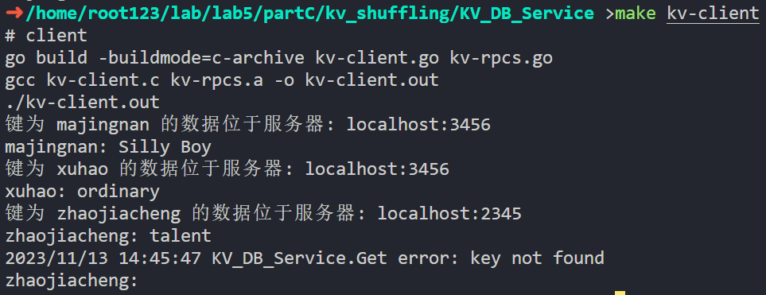

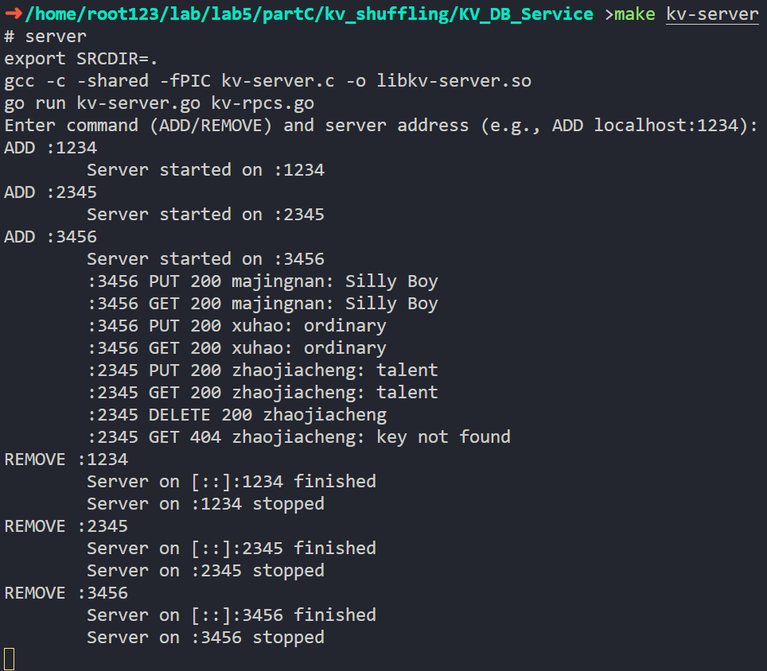

**然而，如果只是用协程实现，那么所有的kv对还是会存储在同一个哈希表中**：
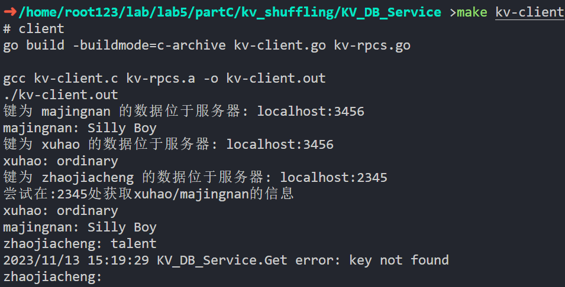
如图，尝试在:2345处获取xuhao/majingnan的信息，成功了。这显然不合理。

因此，在需要改变kv对实际存储位置的测试中，我们还是**需要启动多个进程来作为kv存储服务器**。
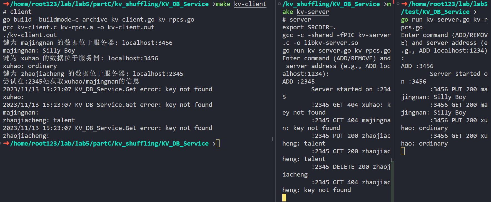
如图，这样就可以保证不同的kv对存储在不同的服务器上。有了这个交互式的kv存储系统，能大大减轻我们的调试负担，我们就可以开始着手实现kv shuffling了。

#### manager
最后终于来到最复杂的manager模块。我们需要实现的功能有：
- 与master-server通讯，管理kv存储服务器的增减
- 与kv-server通讯，管理kv对的实际分配

为了便于调试，我将这个模块设计成交互式的，即manager会等待用户输入指令，然后执行对应的操作。共有`ADD/REMOVE/PUT/GET/DELETE/SHOWALL`这6条指令。

其中，`ADD/REMOVE`用于增加/删除kv存储服务器，`PUT/GET/DELETE`用于生成/获取/删除kv对，`SHOWALL`用于显示所有kv对及其位置。

我实现的**KV Shuffling核心逻辑**是一一对照新旧config，将失效的区间的key-value删除，并将新的区间的key-value自动分配到对应的服务器中。

<div STYLE="page-break-after: always;"></div>


#### 测试1. 与master-server通讯，管理kv存储服务器的增减
首先我们开3个分布式存储服务进程，分别绑定2345，3456，4567端口，让master-server绑定在1234端口。
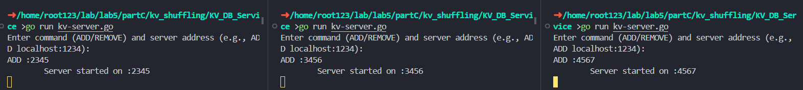

以如图所示键入指令给manager，client按照Exercise1的测试代码运行，master-server和kv-server无需键入指令，直接运行即可。
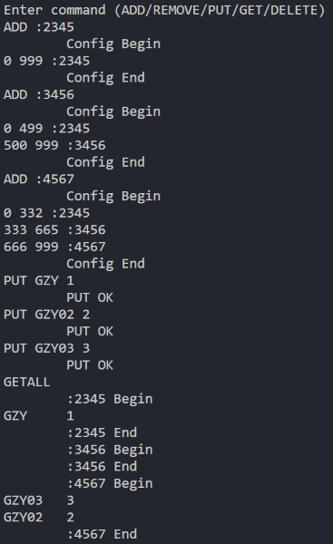

得到的master-server和kv-server的行为如下：
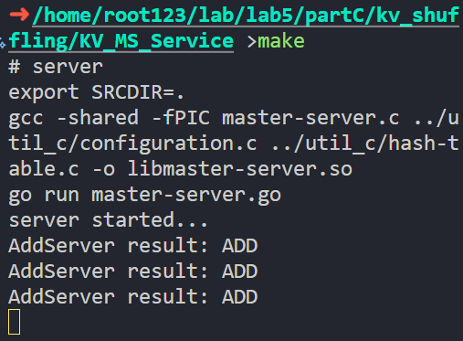
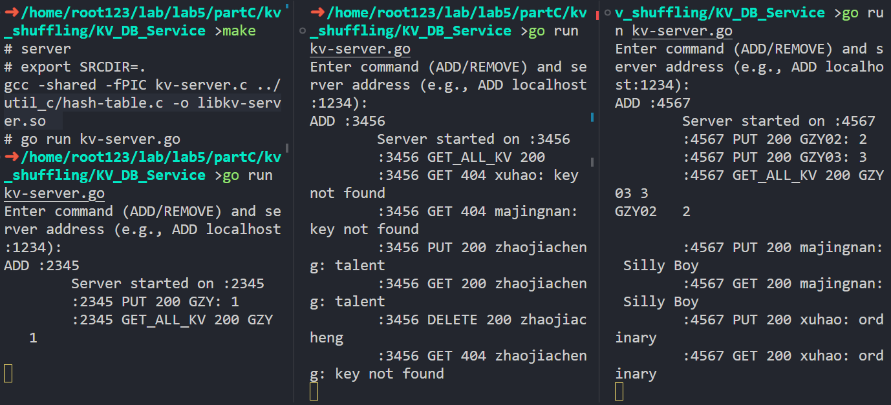

<div STYLE="page-break-after: always;"></div>

#### 测试2. 与kv-server通讯，管理kv对的实际分配
依然开3个分布式存储服务进程，分别绑定2345，3456，4567端口，让master-server绑定在1234端口。

我们PUT一些个键值对，然后观察他们的存储分布情况。将其中一个服务器移除，可以看到，它所保存的kv对被重新分配到其他服务器上了。

manager行为：
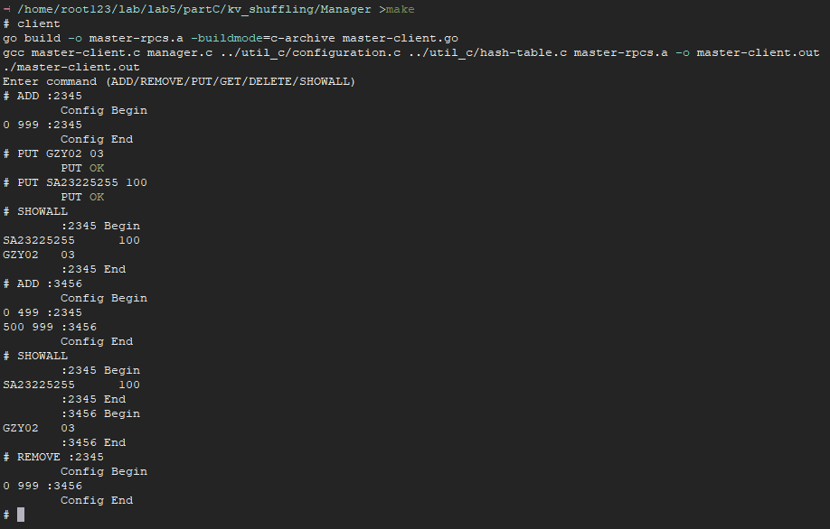
kv-server行为：
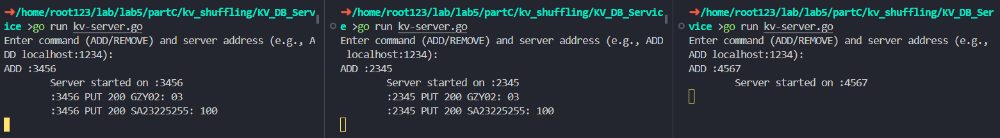
master-server行为：
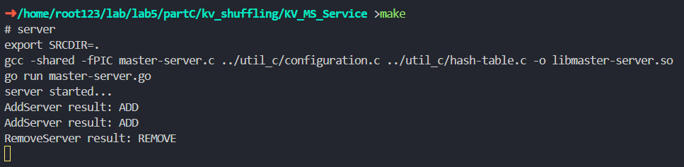


<div STYLE="page-break-after: always;"></div>


# 总结
在做这个实验的过程中，最后一节课华老师说的“这个实验我们不用写一行go代码”一直在我的脑子里回响，让我印象深刻，而我也正是因为这句话入了lab5这个大坑的。然而40h的实验做完后，除了需要学10h的go语言外，lab5可以说没有任何缺点，可以让人深刻领悟到并发编程尤其是多服务端、多客户端编程的魅力~~，并在debug的过程中被折磨疯~~。

这个实验的难度确实很大，但是收获也是最大的，其中Part B&C让人印象深刻：让我们自己设计一个框架，甚至不给示例程序的做法初看确实容易让人崩溃，但是这样的做法确实让我们真正地理解了MapReduce和KV Shuffling的原理，也让我们对go语言和gRPC有了更深刻的认识。正是因为完成实验中最精华的Part B&C需要一定的go语言基础，实验过程中go这座大山便不能被轻易忽视，尤其是其中还涉及了cgo、go语言的包管理等对调试不友好的内容，这也是我花费大量时间的原因。

我认为之后的课程里可以适当增加对go语言的使用，在lab5之前就提前给出go语言的学习资料，以防入门时便被go语言这座大山吓跑，从而错过了这么优秀的实验内容。同时可能还需要补充更多文档，以便下一届同学们能够更好地完成这个实验。毕竟相比于文档详尽的lab0~4，这个实验的说明文档实在是太贫乏了。虽然我理解这个实验考察的主要是设计问题，所以开放给我们自己做，留出了足够多的自由空间，但是这样的做法也让我在实验过程中遇到了很多困难，例如我在Part B的Exercise 3以及Part C的Exercise 3~5的就遇到了非常非常多的问题，最后只能自己摸索出来。如果有更多的文档（例如一个大体的设计思路），我相信我可以更快更好地完成这个实验。

lab0~4也都相当有趣，这一系列实验设置得环环相扣，循序渐进。从C语言的编译过程和linux程序的执行过程开始，到多进程、多线程的并发控制和网络编程的简单小程序实现，再到这次lab5中实现一个较为复杂的分布式系统。不是靠课堂上的说教，而是靠这一系列的实验将工程化C程序设计的理念清晰地印刻在我们心中，让我们对C语言的使用有了更深刻的认识，也让我们对操作系统、网络编程、并发编程有了更深刻的理解。

感谢工程C课程的老师和助教们，为我们带来了这么有意思的实验。这是我5年大学时光中上过的最好的一门专业课。

</br></br></br></br></br></br>
