<h1 align=center>Lab 5: MapReduce</h1>

<div align=right>SA23225XXX 高XX</div>

# 写在开头
作为一个此前对go语言和MapReduce完全无知的学生，本次lab共花费了我**超过40小时**的时间，花费的时间是lab1~4的总和。Debug时我数次熬夜，中途无数次地想过要不就此放弃，改做一个不限题材字数的报告水水过去算了。但最后我还是坚持了下来，终于保质保量地完成了所有exercise。

**请务必耐心看完，我拼上性命写完的报告。向这学习曲线极为陡峭的lab5，献上我全部的爱。**


# Part A: RPC
Part A非常简单，补充C语言核心代码即可，总共花费1h不到。但最重要的是，我们可以从这个Part的代码中学到很多关于gRPC和cgo的知识，这对之后的实验尤为重要。
## Services and RPCs
### Exercise 1
`square-server.c`:
```C
int square(int x)
{
    return x * x;
}
```
实验结果如下：

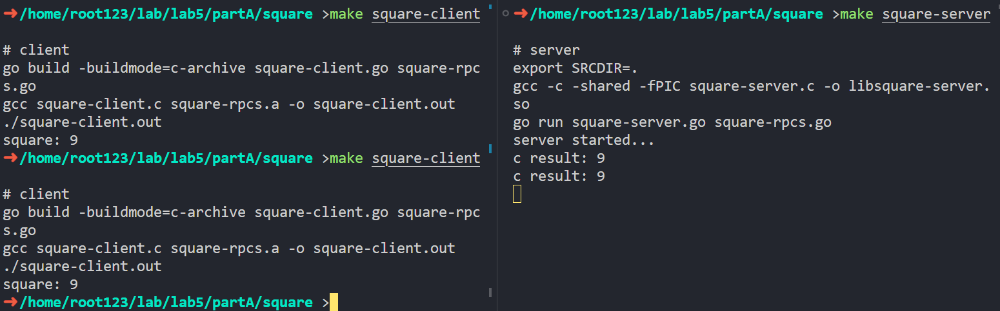

### Exercise 2
`square-server.c`:
```C
int CountString(char *str)
{
    int i = 0, status = 1, ans = 0;
    while (str[i])
    {
        if (str[i] == ' ')
        {
            status = 1;
        }
        else
        {
            if (status == 1)
                ++ans;
            status = 2;
        }
        ++i;
    }
    return ans;
}
```
实验结果如下：

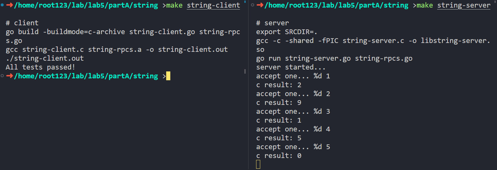

### Exercise 3
非并发栈实现 `stack-server.c`:
```C
void stack_push(int value)
{
    node_t *new_node = malloc(sizeof(node_t));
    new_node->value = value;
    new_node->next = stack.top;
    stack.top = new_node;
}

int stack_pop()
{
    int value = -1;
    node_t *del = stack.top;
    if (del)
    {
        stack.top = stack.top->next;
        value = del->value;
        free(del);
    }
    return value;
}

int stack_size()
{
    int size = 0;
    node_t *cur = stack.top;
    while (cur)
    {
        cur = cur->next;
        ++size;
    }
    return size;
}
```
实验结果如下：

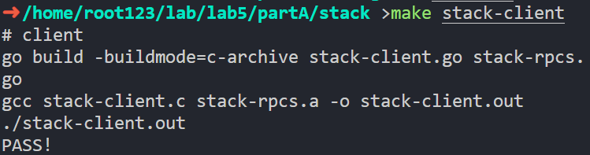

## Concurrency and Locks
### Exercise 1
实验结果如下：

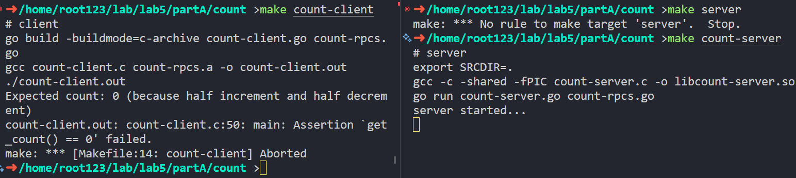

期望结果应为`get_count=0`。由于客户端起了多个线程并发访问服务端程序，而服务端程序中的`count`变量没有加锁，因此会出现多个线程通过RPC同时访问`count`变量的情况，导致`get_count`的值不为0。
### Exercise 2
`count-server.c`:
```C
#include <pthread.h>
pthread_mutex_t mu;

int count = 0;

int increment()
{
    pthread_mutex_lock(&mu);
    count++;
    pthread_mutex_unlock(&mu);
    return count;
}

int decrement()
{
    pthread_mutex_lock(&mu);
    count--;
    pthread_mutex_unlock(&mu);
    return count;
}

int get_count()
{
    return count;
}
```
实验结果如下：

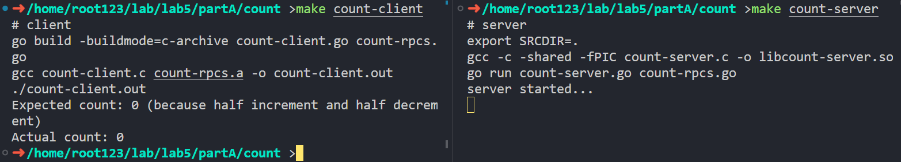
### Exercise 3
并发栈实现`stack-server.c`:
```C
typedef struct Node_t
{
    int value;
    struct Node_t *next;
} node_t;
typedef _Atomic(node_t *) atomic_node;
typedef struct Stack_t
{
    atomic_node top;
} stack_t;

stack_t stack;

void stack_init()
{
    atomic_init(&stack.top, NULL);
    return;
}

void stack_push(int value)
{
    node_t *new_node = malloc(sizeof(node_t));
    new_node->value = value;

    new_node->next = atomic_load(&stack.top);
    while (!atomic_compare_exchange_weak(&stack.top, &new_node->next, new_node))
        ;
}

int stack_pop()
{
    int value = -1;
    node_t *del = atomic_load(&stack.top);
    while (del && !atomic_compare_exchange_weak(&stack.top, &del, del->next))
        ;
    if (del)
    {
        value = del->value;
        free(del);
    }
    return value;
}

int stack_size()
{
    int size = 0;
    node_t *cur = stack.top;
    while (cur)
    {
        cur = cur->next;
        ++size;
    }
    return size;
}

```
实验结果如下：

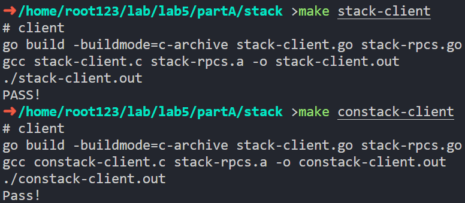

<div STYLE="page-break-after: always;"></div>


# Part B: MapReduce
Part B的实验内容非常丰富，包含了**顺序MapReduce**、**并发MapReduce**、**分布式MapReduce**三个部分，相比于Part A难度暴增，这三个部分的难度也呈指数上升。这里我将分三部分详细介绍我的实现过程。

首先利用`python3 generate-words.py 10 1M`生成数据集，其中`10`为文件数量，`1M`为数据集大小。存储在`./data`文件夹中，文件名为`a.txt`，`b.txt`，`c.txt`，`d.txt`，`e.txt`，`f.txt`，`g.txt`，`h.txt`，`i.txt`，`j.txt`。

## Sequential MapReduce
为了完成这个实验，我首先去看了Google的MapReduce论文，并在网上找到了它的java实现，初步建立了对MapReduce过程的基本认知。*（花费时间：3h）*

随后，我认真阅读了示例代码，弄清楚了示例代码中`file-struct`、`list`和`hash-table`等模块的实现逻辑。*（花费时间：1h）*

最后，我开始着手实现MapReduce的过程。由于这个实验的代码结构非常复杂，这里只贴出最重要的代码，完整代码请见[code/partB/sequential-mr](./code/partB/sequential-mr)。*（花费时间：1h）*

### Exercise 1
首先修改Makefile：
```Makefile
all: counter-mr.so seq-mr.out

counter-mr.so: 
	gcc -g -shared -fPIC -o counter-mr.so ../util/counter-mr.c ../util/key-value.c ../lib/list.c

seq-mr.out: 
	gcc -g seq-mr.c ../util/key-value.c ../lib/list.c file-struct.c ../lib/concur-hash.c -o seq-mr.out -ldl
	./seq-mr.out 4 ./counter-mr.so a.txt b.txt c.txt d.txt e.txt f.txt g.txt h.txt i.txt j.txt

clean:
	rm -rf *.so *.out ./output/
```
如上所示，因为**reduce过程需要使用哈希表**（位于lib文件夹，LAB4里的实现的数据结构）。同时，我们在Makefile里指定运行时参数，以方便调试。此后的**所有实验均需修改makefile**，而不能简单使用给定的makefile，但一一说明过于繁琐，因此此后不再赘述。

然后我们实现`map_phase`函数：
```C
void map_phase(fnode *node, int nInput, int nOutputs)
{
    for (int i = 0; i < nInput; ++i)
    {
        file_list cur_file_list = node->files[i];
        char *buf = read_file(cur_file_list.fname);
        list_t cur_kv_list = mr_map(buf); // 将文件内容读入内存，然后调用mr_map，统计词频，得到cur_kv_list
        free(buf);                        // 防止泄漏内存
        for (int i = 0; i < cur_kv_list->last; ++i)
        {
            kv_t cur_kv = cur_kv_list->containter[i];
            int map_id = djb_hash(cur_kv->key) % nOutputs;
            const char *output_filename = cur_file_list.inter->file_paths[map_id]; // 映射到的文件名
            FILE *fp = fopen(output_filename, "a");
            if (fp == NULL)
            {
                perror("fopen map_phase");
                exit(EXIT_FAILURE);
            }
            fprintf(fp, "%s %s\n", cur_kv->key, cur_kv->value); // 将k v写入文件
            fclose(fp);
        }
        list_destroy(cur_kv_list); // 防止泄漏内存
    }
}
```

`map_phase`函数流程：首先遍历每个输入文件，读取文件内容，然后调用`mr_map`函数，统计词频，得到`cur_kv_list`。然后遍历`cur_kv_list`，对于每个键值对，计算哈希值，映射到对应的输出文件，然后将键值对写入临时文件。

然后我们实现`reduce_phase`函数：
```C
#include "../lib/concur-hash.h"
void reduce_phase(fnode *node, int nInput, int nOutputs)
{
    for (int j = 0; j < nOutputs; ++j)
    {
        char output_filename[256];
        snprintf(output_filename, sizeof(output_filename), "%s/%d.txt", node->output_dir, j + 1);
        FILE *fp = fopen(output_filename, "w");
        if (fp == NULL)
        {
            perror("fopen reduce_phase");
            exit(EXIT_FAILURE);
        }

        hash_t *hash_table = calloc(1, sizeof(*hash_table));
        hash_init(hash_table, 1024); // 1024个桶

        for (int i = 0; i < nInput; ++i)
        {
            char *buf = read_file_path(node->files[i].inter->file_paths[j]);
            char *saveptr_buf, *saveptr_line;
            char *line = strtok_r(buf, "\n", &saveptr_buf);
            while (line != NULL)
            {
                char *key = strtok_r(line, " ", &saveptr_line);
                char *value_str = strtok_r(NULL, " ", &saveptr_line);
                int value = atoi(value_str);

                // 处理键和值
                int *it = hash_lookup(hash_table, key);
                if (it == NULL)
                    hash_insert(hash_table, key, value);
                else
                    *it += value;

                line = strtok_r(NULL, "\n", &saveptr_buf);
            }
            free(buf); // 防止泄漏内存
        }
        // 遍历哈希表，写文件
        for (int i = 0; i < hash_table->num_buckets; ++i)
        {
            pthread_rwlock_rdlock(&hash_table->mu[i]);
            node_t *node = hash_table->buckets[i];
            while (node != NULL)
            {
                fprintf(fp, "%s %d\n", node->key, node->value);
                node = node->next;
            }
            pthread_rwlock_unlock(&hash_table->mu[i]);
        }
        // 销毁哈希表
        hash_destroy(hash_table);
        fclose(fp);
    }
}
```

`reduce_phase`函数流程：首先遍历每个输出文件，然后遍历相对应的输入文件，读取临时文件内容。遍历输入的每一行，将键值对插入哈希表。最后遍历哈希表，将键值对写入文件。

`map`得到`nInput*nOutput`个文件：

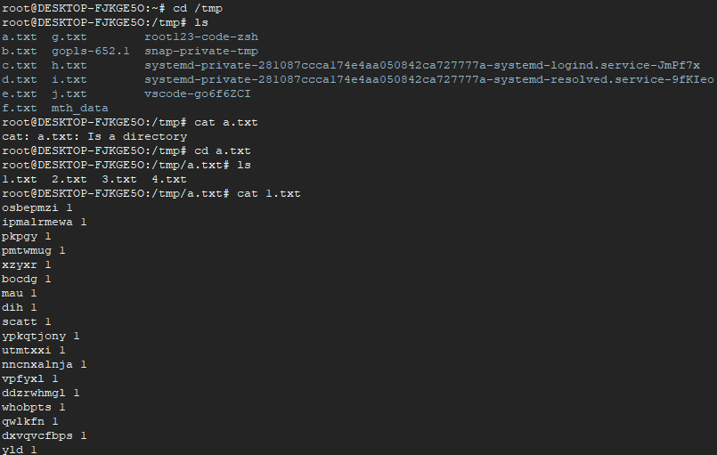

`reduce`得到4个文件，分别为`1.txt`，`2.txt`，`3.txt`，`4.txt`，内容如下：

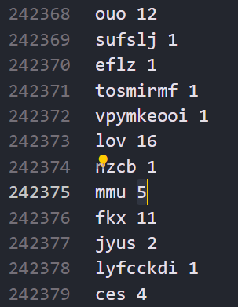

运行结果如下：

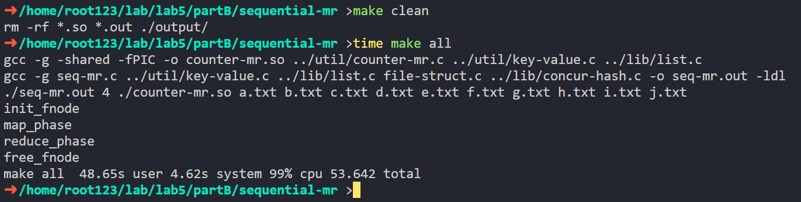


<div STYLE="page-break-after: always;"></div>


## Concurrent MapReduce

### Exercise 2
这个实验几乎没有给任何框架代码，自由度极高。因此，我决定采用`nInput`个线程来并发执行`map_phase`，然后采用`nOutput`个线程来并发执行`reduce_phase`。这样做的好处是，**可以充分利用多核CPU的优势**，同时**减少线程间的竞争**。

我原以为这样进行并发控制可以使得这个实验很简单，但实际上我遇到了很多问题。例如，**多线程下的`strtok`函数和哈希表会出现问题**，因此我不得不改用`concur-hash`，并在每个桶的`pthread_rwlock`的调试上花费了大量时间。*（花费时间：3h）*

**使用`strtok_r`来保证线程安全**是因为`strtok`会用全局变量来保存上一次调用的位置，因此在多线程环境下会出现问题。

与Exercise 1一样，我们依旧需要修改Makefile，因为**reduce过程需要使用哈希表**，因此需要编译`concur-hash.c`（位于lib文件夹，为LAB4里的实现的数据结构，利用**读写锁对每个桶进行细粒度的并发控制**）。我们采用Exercise 1里写好的`file-struct`框架，因此需要编译`file-struct.c`。同时，我们在Makefile里指定运行时参数。

Task定义和实现：
```C
typedef struct Task_t
{
    int result_size;    // 输出文件的个数
    int task_size;      // 输入文件的个数
    const char **files; // 输入文件的名字
    fnode *node;
} task_t;

void Task_init(task_t *task, int task_size, const char **files, int result_size, const char *OUTPUT_DIR, const char *TMP_DIR)
{
    task->task_size = task_size;
    task->files = files;
    task->result_size = result_size;

    printf("init_fnode\n");
    task->node = init_fnode(task_size, files, result_size, TMP_DIR, OUTPUT_DIR);
}
```
多线程实现：
```C
void *work_map(void *arg)
{
    long id = (long)arg;
    char *str = malloc(32);  // 为字符串分配足够的空间
    sprintf(str, "%ld", id); // 将long转换为字符串
    map_phase(&task, str);
    free(str); // 释放内存
    pthread_exit(0);
}

void *work_reduce(void *arg)
{
    long id = (long)arg;
    char *str = malloc(32);  // 为字符串分配足够的空间
    sprintf(str, "%ld", id); // 将long转换为字符串
    reduce_phase(&task, str);
    free(str); // 释放内存
    pthread_exit(0);
}

int main(int argc, char *argv[]){
    //...
    Task_init(&task, task_size, (const char **)file_name, result_size, OUTPUT_DIR, TMP_DIR);
    free(file_name);
    pthread_t threads[BUFF_SIZE];

    printf("map_phase\n");
    for (long i = 0; i < task_size; i++)
        pthread_create(&threads[i], NULL, work_map, (void *)i);
    for (int i = 0; i < task_size; i++)
        pthread_join(threads[i], NULL);

    printf("reduce_phase\n");
    for (long i = 0; i < result_size; i++)
        pthread_create(&threads[i], NULL, work_reduce, (void *)i);
    for (int i = 0; i < result_size; i++)
        pthread_join(threads[i], NULL);
    Task_destroy(&task);
    return 0;
}
```
MapReduce实现：
```C
// map_name是要处理的文件id
void map_phase(task_t *task, char *map_name)
{
    fnode *node = task->node;
    int nOutputs = task->result_size;
    int map_id = atoi(map_name);
    file_list cur_file_list = node->files[map_id];
    char *buf = read_file(cur_file_list.fname);
    list_t cur_kv_list = mr_map(buf); // 将文件内容读入内存，然后调用mr_map，统计词频，得到cur_kv_list
    free(buf);                        // 防止泄漏内存

    for (int i = 0; i < cur_kv_list->last; ++i)
    {
        kv_t cur_kv = cur_kv_list->containter[i];
        int map_id = djb_hash(cur_kv->key) % nOutputs;
        const char *output_filename = cur_file_list.inter->file_paths[map_id]; // 映射到的文件名
        FILE *fp = fopen(output_filename, "a");
        if (fp == NULL)
        {
            perror("fopen map_phase");
            exit(EXIT_FAILURE);
        }
        fprintf(fp, "%s %s\n", cur_kv->key, cur_kv->value); // 将k v写入文件
        fclose(fp);
    }
    list_destroy(cur_kv_list); // 防止泄漏内存
}

// reduce_name是要写入的文件id
void reduce_phase(task_t *task, char *reduce_name)
{
    fnode *node = task->node;
    int nInput = task->task_size;
    char output_filename[256];
    int reduce_id = atoi(reduce_name);
    snprintf(output_filename, sizeof(output_filename), "%s/%d.txt", node->output_dir, reduce_id + 1);
    FILE *fp = fopen(output_filename, "w");
    if (fp == NULL)
    {
        perror("fopen reduce_phase");
        exit(EXIT_FAILURE);
    }

    hash_t *hash_table = calloc(1, sizeof(*hash_table));
    hash_init(hash_table, 1024); // 1024个桶

    for (int i = 0; i < nInput; ++i)
    {
        char *buf = read_file_path(node->files[i].inter->file_paths[reduce_id]);
        char *saveptr_buf, *saveptr_line;
        char *line = strtok_r(buf, "\n", &saveptr_buf);
        while (line != NULL)
        {
            char *key = strtok_r(line, " ", &saveptr_line);
            char *value_str = strtok_r(NULL, " ", &saveptr_line);
            int value = atoi(value_str);

            // 处理键和值
            int *it = hash_lookup(hash_table, key);
            if (it == NULL)
                hash_insert(hash_table, key, value);
            else
                *it += value;

            line = strtok_r(NULL, "\n", &saveptr_buf);
        }
        free(buf); // 防止泄漏内存
    }
    // 遍历哈希表，写文件
    for (int i = 0; i < hash_table->num_buckets; ++i)
    {
        pthread_rwlock_rdlock(&hash_table->mu[i]); // 单线程情形下也可不加锁
        node_t *node = hash_table->buckets[i];
        while (node != NULL)
        {
            fprintf(fp, "%s %d\n", node->key, node->value);
            node = node->next;
        }
        pthread_rwlock_unlock(&hash_table->mu[i]);
    }
    // 销毁哈希表
    hash_destroy(hash_table);
    fclose(fp);
}
```

运行结果如下：

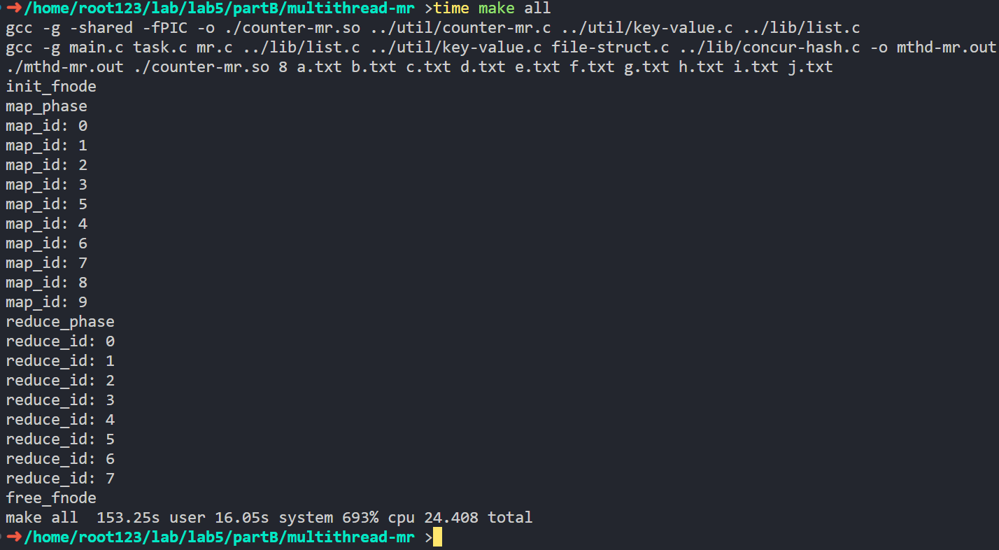
可以看到，性能相比Exercise 1有了明显的提升。生成的文件格式与Exercise 1相同，内容不再赘述。

<div STYLE="page-break-after: always;"></div>

## Distributed MapReduce
### Exercise 3
**对于无go语言基础的我，该Exercise共花费至少20h，因此在此我将详细记述我的这段经历**

首先，看到这个Exercise，我完全是一脸懵逼的。这个Exercise没有任何C语言的接口定义和说明。每个接口的输入输出、实现功能是什么？我不知道。我能看到的只有go语言的接口调用，但我对go语言一无所知，完全不知道该怎么实现啊……而且有些接口的返回值是什么意思我也不知道啊……当我看到有一个接口写死必须返回“finish”这种情况时，我的心情是崩溃的……

没办法，为了完成这个Exercise，我决定先学习go语言的基础知识，然后再来完成这个Exercise。所以，我首先在wsl上部署了[gotour](tour.go-zh.org)，然后开始从零学习go语言。我发现go语言的语法和C语言有很多相似之处，因此学的还算比较快。_（花费时间：10h）_

学习了一天掌握了基本语法后，我逐渐能看懂给的go例程了，也大概明白要在C语言上实现哪些接口了。我做的第一件事是看懂并修改go例程和makefile。将序列化反序列化逻辑移到C语言实现，以简化接口定义（这样接口定义就只是一个简单的`char*`而非自定义结构体接口了）为了完成这一步，我们至少要学会使用go的strings包。_（花费时间：1h）_

接着，先用C语言写一个序列化反序列化逻辑，把worker和master的消息传递模块先跑通，防止在这一步出现bug（在单个.c文件里面跑通就行）。_（花费时间：1h）_

随后，我先写了server端，把要MapReduce的文件列表相互传输（这里一定要注意go代码里的逻辑，`map_name`和`reduce_name`必须要在文件列表的第一个）。然后写一个Task调度器，决定client的动作（我实现的很简单，只有MAP/REDUCE/WAIT/FINISH这四个动作，而且map做完才给做reduce）

server端很容易出现bug，因为**必须考虑线程安全**。例如`strtok`函数就不能用，而要改用`strtok_r`，所用的哈希表也要考虑线程安全。我在这里花费了很多时间，绝大部分花在查看打印日志上。_（花费时间：6h）_

最后再写client端C代码，为了模拟race condition开多线程。根据server的task反馈决定完成MAP/REDUCE/WAIT/FINISH动作。client端的MAP/REDUCE代码可以抄前面实现的代码。_（花费时间：2h）_

最后呈现出的效果如下：
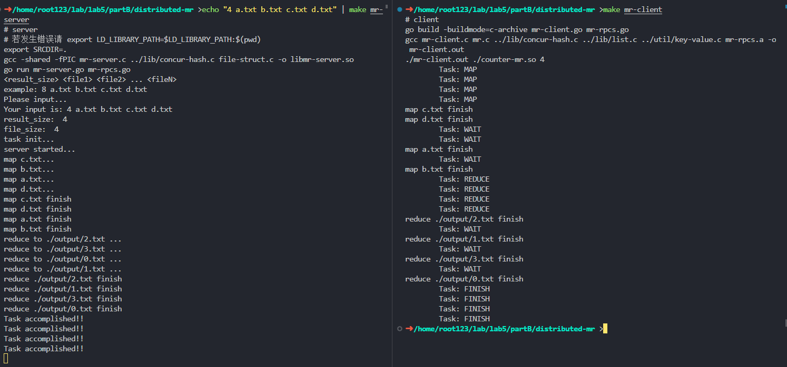

<div STYLE="page-break-after: always;"></div>

该实验的代码结构非常复杂，这里只贴出最重要的代码，完整代码请见[code/partB/distributed-mr](./code/partB/distributed-mr)。

首先，修改go代码：
```go
//mr-client.go
func Reduce_get() *C.char {
	client := connect()
	args := Reduce_t{}
	reply := Reduce_t{}
	err := client.Call("MRService.Reduce_get", &args, &reply)
	if err != nil {
		log.Fatal("error:", err)
	}
	client.Close()
	// 传输过来的已经是序列化后的字符串了，不需要再序列化
	return C.CString(reply.Name)
}

//mr-server.go
func (mr *MRService) Reduce_get(args *Reduce_t, reply *Reduce_t) error {
	rdc := C.reduce_get()
	if rdc == nil {
		return nil
	}
	// 传输过来的已经是序列化后的字符串了
	reply.Name = C.GoString(rdc)
	fmt.Println("reduce to " + strings.Split(reply.Name, SEP)[0] + " ...")
	return nil
}
```
这是因为传输过来的已经是序列化后的字符串了，不需要再序列化。

然后，定义C的接口以及Task数据结构（mr-server.h）:
```C
typedef struct Task_t
{
    int result_size; // 输出文件的个数
    int task_size;   // 输入文件的个数
    fnode *node;     // 文件管理系统
    hash_t map_waiting, reduce_waiting, map_working, reduce_working;
} task_t;

void Task_destroy(task_t *task);
char *task_get();
char *map_get();
void map_finish(char *filename, char **file_names);
char *reduce_get();
void reduce_finish(char *reduce_name);
int get_mapsize();
int get_reducesize();
void task_init(int file_size, char **array, int result_size);
```
我们继续沿用Exercise 2里的Task数据结构，只是增加了一些哈希表来管理任务状态。
在这里，由于map和reduce得到的文件路径由client指定，因此`init_fnode`函数需要修改，将`create_files`函数注释掉，防止其创建文件。

哈希表管理任务状态的逻辑如下：
- 如果`map_waiting`里有任务，就从`map_waiting`里取出一个任务，然后放入`map_working`里，然后令worker执行MAP操作。
- MAP操作完成后，如果`map_working`里的任务全部做完，就填充`result_size`个任务进入`reduce_waiting`。
- 如果`reduce_waiting`里有任务，从`reduce_waiting`里取出一个任务，然后放入`reduce_working`里，然后令worker执行REDUCE操作。
- REDUCE操作完成后，如果`reduce_working`里的任务全部做完，标记task完成。此后只会向worker返回FINISH。
- 除此以外，返回WAIT。（例如`map_waiting`空而`map_working`不为空、`reduce_waiting`空而`reduce_working`不为空）

基于此，我们将上述接口一一实现（mr-server.c）：
```C
task_t *task; // 全局变量
const char *OUTPUT_DIR = "./output", *TMP_DIR = "/tmp/distri_data", *SEP = "\n";
const int num_buckets = 8; // 用来管理文件的hash表的桶数

void task_init(int file_size, char **array, int result_size)
{
    task = (task_t *)malloc(sizeof(task_t));
    hash_init(&task->map_waiting, num_buckets);
    hash_init(&task->reduce_waiting, num_buckets);
    hash_init(&task->map_working, num_buckets);
    hash_init(&task->reduce_working, num_buckets);
    task->task_size = file_size;
    task->result_size = result_size;
    task->node = init_fnode(file_size, (const char **)array, result_size, TMP_DIR, OUTPUT_DIR);
    for (int i = 0; i < file_size; i++)
    {
        hash_insert(&task->map_waiting, array[i], i);
    }
}

// worker的调度策略，先map再reduce
char *task_get()
{
    int map_waiting_size = hash_size(&task->map_waiting);
    int map_working_size = hash_size(&task->map_working);
    int reduce_waiting_size = hash_size(&task->reduce_waiting);
    int reduce_working_size = hash_size(&task->reduce_working);

    if (map_waiting_size == 0 && map_working_size == 0 && reduce_waiting_size == 0 && reduce_working_size == 0)
        return "FINISH";
    else if (map_waiting_size != 0)
        return "MAP";
    else if (reduce_waiting_size != 0)
        return "REDUCE";
    else
        return "WAIT";
}

char *map_get()
{
    //  从map_waiting中取出一个文件名，放入map_working中
    node_t *node = hash_get_first(&task->map_waiting);
    if (node == NULL)
    {
        return NULL;
    }
    char *filename = node->key;
    int id = node->value;
    free(node);
    hash_insert(&task->map_working, filename, id);
    return filename;
}


void map_finish(char *filename, char **file_names)
{
    int id = *hash_lookup(&task->map_working, filename);
    if (hash_delete(&task->map_working, filename) == 1)
    {
        perror("\tmap_finish delete error\n");
        return;
    }
    for (int i = 0; i < task->result_size; i++)
    {
        task->node->files[id].inter->file_paths[i] = strdup(file_names[i]);
    }
    // 如果map_waiting和map_working都为空，就将reduce_waiting填满
    if (hash_size(&task->map_waiting) == 0 && hash_size(&task->map_working) == 0)
    {
        for (int j = 0; j < task->result_size; j++)
        {
            // 生成reduce的文件名和要读取的文件（序列化）
            char buffer[1024];
            sprintf(buffer, "%s/%d.txt", task->node->output_dir, j);
            for (int i = 0; i < task->task_size; i++)
            {
                const char *target_path = task->node->files[i].inter->file_paths[j];
                strcat(buffer, SEP); // 序列化，用SEP分割
                strcat(buffer, target_path);
            }
            // 将文件名和文件内容写入reduce_waiting
            hash_insert(&task->reduce_waiting, strdup(buffer), j);
        }
    }
}

char *reduce_get()
{
    //  从reduce_waiting中取出一个文件名，放入reduce_working中
    node_t *node = hash_get_first(&task->reduce_waiting);
    if (node == NULL)
    {
        return NULL;
    }
    char *filename = node->key;
    int id = node->value;
    free(node);
    hash_insert(&task->reduce_working, filename, id);
    return filename;
}

void reduce_finish(char *reduce_name)
{
    if (hash_delete(&task->reduce_working, reduce_name) == 1)
    {
        perror("\treduce_finish delete error\n");
        return;
    }
}

int get_mapsize()
{
    return task->task_size;
}
int get_reducesize()
{
    return task->result_size;
}
```

随后，我们转战client端，实现worker的逻辑（mr-client.c）：
```C
void *work(void *arg)
{
    while (1)
    {
        char *task = strdup(Task_get());
        printf("\tTask: %s\n", task);
        if (strcmp(task, "FINISH") == 0)
        {
            pthread_exit(NULL);
        }
        else if (strcmp(task, "WAIT") == 0)
        {
            sleep(WAIT_TIME);
            continue;
        }
        else if (strcmp(task, "MAP") == 0)
        {
            char *filename = Map_get();
            if (filename == NULL || strcmp(filename, "") == 0)
            {
                continue;
            }
            int nOutput = Get_reducesize();
            char **files = map_phase(filename, nOutput);
            Map_finish(files, nOutput);
        }
        else if (strcmp(task, "REDUCE") == 0)
        {
            char *reduce_name_list = Reduce_get();
            if (reduce_name_list == NULL || strcmp(reduce_name_list, "") == 0)
            {
                continue;
            }
            char *savecopy = strdup(reduce_name_list);
            int nInput = Get_mapsize();
            char *saveptr;
            char *reduce_name = strtok_r(reduce_name_list, SEP, &saveptr);
            char **reduce_list = (char **)malloc(sizeof(char *) * (nInput));
            for (int i = 0; i < nInput; ++i)
            {
                reduce_list[i] = strtok_r(NULL, SEP, &saveptr);
            }
            reduce_phase(reduce_name, reduce_list, nInput);
            Reduce_finish(savecopy);
            free(reduce_list);
            free(savecopy);
        }
        else
        {
            perror("\ttask error\n");
            exit(1);
        }
        free(task);
    }
}

int main(int argc, char *argv[])
{
    // ...
    pthread_t workers[worker_size];
    for (int i = 0; i < worker_size; i++)
    {
        pthread_create(&workers[i], NULL, work, NULL);
    }
    for (int i = 0; i < worker_size; i++)
    {
        pthread_join(workers[i], NULL);
    }
    return 0;
}
```

最后是MapReduce的核心逻辑（mr.c）：
```C
char **map_phase(char *map_name, int reduce_size)
{
    char *buf = read_file(map_name);
    list_t cur_kv_list = mr_map(buf); // 将文件内容读入内存，然后调用mr_map，统计词频，得到cur_kv_list
    free(buf);                        // 防止泄漏内存
    char **ret = (char **)malloc(sizeof(char *) * (reduce_size + 1));
    ret[0] = map_name;
    FILE *fp[reduce_size + 1];
    for (int i = 1; i <= reduce_size; ++i)
    {
        char output_filename[256];
        snprintf(output_filename, sizeof(output_filename), "%s/%s-%d.txt", TMP_DIR, map_name, i);
        fp[i] = fopen(output_filename, "w");
        if (fp == NULL)
        {
            perror("fopen map_phase");
            exit(EXIT_FAILURE);
        }
        ret[i] = strdup(output_filename);
    }
    for (int i = 0; i < cur_kv_list->last; ++i)
    {
        kv_t cur_kv = cur_kv_list->containter[i];
        int map_id = djb_hash(cur_kv->key) % reduce_size;
        fprintf(fp[map_id + 1], "%s %s\n", cur_kv->key, cur_kv->value); // 将k v写入文件
    }
    for (int i = 1; i <= reduce_size; ++i)
        fclose(fp[i]);
    list_destroy(cur_kv_list); // 防止泄漏内存
    return ret;
}

void reduce_phase(char *reduce_name, char **input_files, int nInput)
{
    FILE *fp = fopen(reduce_name, "w");
    if (fp == NULL)
    {
        perror("fopen reduce_phase");
        exit(EXIT_FAILURE);
    }

    hash_t *hash_table = calloc(1, sizeof(*hash_table));
    hash_init(hash_table, 1024); // 1024个桶

    for (int i = 0; i < nInput; ++i)
    {
        char *buf = read_file_path(input_files[i]);
        char *saveptr_buf, *saveptr_line;
        char *line = strtok_r(buf, "\n", &saveptr_buf);
        while (line != NULL)
        {
            char *key = strtok_r(line, " ", &saveptr_line);
            char *value_str = strtok_r(NULL, " ", &saveptr_line);
            int value = atoi(value_str);

            // 处理键和值
            int *it = hash_lookup(hash_table, key);
            if (it == NULL)
                hash_insert(hash_table, key, value);
            else
                *it += value;

            line = strtok_r(NULL, "\n", &saveptr_buf);
        }
        free(buf); // 防止泄漏内存
    }
    // 遍历哈希表，写文件
    for (int i = 0; i < hash_table->num_buckets; ++i)
    {
        pthread_rwlock_rdlock(&hash_table->mu[i]); // 单线程情形下也可不加锁
        node_t *node = hash_table->buckets[i];
        while (node != NULL)
        {
            fprintf(fp, "%s %d\n", node->key, node->value);
            node = node->next;
        }
        pthread_rwlock_unlock(&hash_table->mu[i]);
    }
    // 销毁哈希表
    hash_destroy(hash_table);
    fclose(fp);
}
```

<div STYLE="page-break-after: always;"></div>

# Part C: Sharded KV Stores
## Sharded KV Stores
### Exercise 1
例程代码已经实现了Exercise 1中的configuration模块，我们只需在每次进行`get`,`delete`,`put`前计算对应的`address`，并调用`Config_IP(address)`变更要发送请求的RPC地址即可。因此这个exercise主要是看懂示例代码，总共花费1h不到。
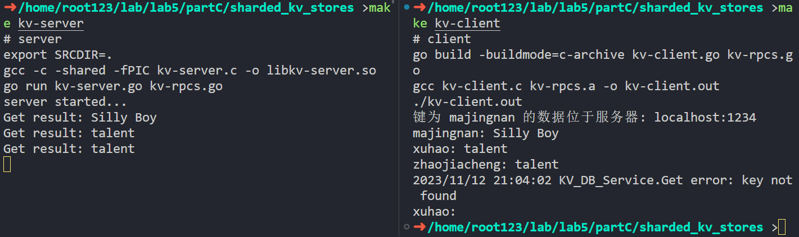

### Exercise 2
例程已经为我们实现了单值情形的k-v映射，因此只需实现`append`，并修改`get`,`delete`,`put`。*（花费时间：1h）*

首先修改.go文件，添加如下代码（要实现的`append`接口）：
`kv-rpcs.go`:
```go
type AppendArgs struct {
	Key   string
	Value string
}

type AppendReply struct {
}
```

`kv-client.go`:
```go
//export Append
func Append(key *C.char, value *C.char) {
	client := connect()
	if client == nil {
		return
	}
	defer client.Close()

	keyGo := C.GoString(key)
	valueGo := C.GoString(value)

	args := AppendArgs{keyGo, valueGo}
	reply := AppendReply{}
	err := client.Call("KV_DB_Service.Append", &args, &reply)
	if err != nil {
		log.Println("error:", err)
	}
}
```

`kv-server.go`:
```go
func (kv *KV_DB_Service) Append(args *AppendArgs, reply *AppendReply) error {
	keyC := C.CString(args.Key)
	valueC := C.CString(args.Value)

	defer C.free(unsafe.Pointer(keyC))
	defer C.free(unsafe.Pointer(valueC))

	C.append(keyC, valueC)
	// C.Append(*C.char(args.Key), *C.char(args.Value))
	return nil
}
```

然后修改`kv-server.c`文件即可（此处使用了PartB里的list.c）
```C
#define BUFFER_SIZE 1024
#define TABLE_SIZE 1000

const char *DELIM = "; ";
typedef struct MapNode
{
    char *key;
    list_t values;
    struct MapNode *next;
} MapNode;

MapNode *hashTable[TABLE_SIZE];

static unsigned int djb_hash(const char *cp)
{
    unsigned hash = 5381;
    while (*cp)
        hash = 33 * hash ^ (unsigned char)*cp++;
    return hash % TABLE_SIZE;
}
MapNode *get_new_node(char *key, char *value)
{
    MapNode *newNode = malloc(sizeof(MapNode));
    newNode->key = strdup(key);
    newNode->values = list_new();
    list_append(newNode->values, strdup(value));
    newNode->next = NULL;
    return newNode;
}

void put(char *key, char *value)
{
    unsigned int index = djb_hash(key);
    MapNode *newNode = get_new_node(key, value);
    if (!hashTable[index])
    {
        hashTable[index] = newNode;
    }
    else
    {
        MapNode *current = hashTable[index];
        while (current)
        {
            if (strcmp(current->key, key) == 0)
            {
                list_destroy(current->values);
                current->values = newNode->values;
                free(newNode->key);
                free(newNode);
                return;
            }
            current = current->next;
        }
        newNode->next = hashTable[index];
        hashTable[index] = newNode;
    }
}

void append(char *key, char *value)
{
    unsigned int index = djb_hash(key);
    if (!hashTable[index])
    {
        hashTable[index] = get_new_node(key, value);
    }
    else
    {
        MapNode *current = hashTable[index];
        while (current)
        {
            if (strcmp(current->key, key) == 0)
            {
                list_append(current->values, strdup(value));
                return;
            }
            current = current->next;
        }
        MapNode *newNode = get_new_node(key, value);
        newNode->next = hashTable[index];
        hashTable[index] = newNode;
    }
}

char *get(char *key)
{
    unsigned int index = djb_hash(key);
    MapNode *current = hashTable[index];
    while (current)
    {
        if (strcmp(current->key, key) == 0)
        {
            static char buffer[BUFFER_SIZE];
            memset(buffer, 0, sizeof(buffer));
            list_t values = current->values;
            for (int i = 0; i < values->last; ++i)
            {
                char *value = values->containter[i];
                strcat(buffer, value);
                strcat(buffer, DELIM);
            }
            return strdup(buffer);
        }
        current = current->next;
    }
    return NULL;
}

void delete(char *key)
{
    unsigned int index = djb_hash(key);
    MapNode *current = hashTable[index];
    MapNode *prev = NULL;

    while (current)
    {
        if (strcmp(current->key, key) == 0)
        {
            if (prev)
            {
                prev->next = current->next;
            }
            else
            {
                hashTable[index] = current->next;
            }
            free(current->key);
            list_destroy(current->values);
            free(current);
            return;
        }
        prev = current;
        current = current->next;
    }
}
```

本地测试：
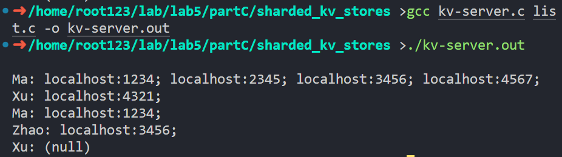

RPC测试：

可以看出，RPC测试的结果和本地测试的结果一致。

测试代码：
```C
int main()
{
    put("majingnan", "localhost:1234");
    put("xuhao", "localhost:4321");
    put("zhaojiacheng", "localhost:3456");
    append("majingnan", "localhost:2345");
    append("majingnan", "localhost:3456");
    append("majingnan", "localhost:4567");
    printf("Ma: %s\n", get("majingnan"));
    printf("Xu: %s\n", get("xuhao"));
    put("majingnan", "localhost:1234");
    printf("Ma: %s\n", get("majingnan"));
    printf("Zhao: %s\n", get("zhaojiacheng"));
    delete ("xuhao");
    printf("Xu: %s\n", get("xuhao"));
    return 0;
}
```

## Sharding Master
实验做到这里我又一次陷入了困境。我一看完全没有示例代码，下载下来的code压缩包里就没有这个文件夹！看到这种情况我是真破防了，怎么连框架代码都没给啊？我该怎么实现这个Exercise？

这是继Distributed MapReduce实验后我离放弃最接近的一次。当我真的想要放弃时，我的心里流露出的是一种不甘。我花了这么多时间学习go语言，学习gRPC和cgo，学习C语言的线程安全，难道就这样放弃了吗？我不甘心啊！

于是我决定新建文件夹，从零开始实现。自己鼓捣一个框架出来，然后再实现这个Exercise。_（花费时间：4h）_

### Exercise 3/4
首先是go文件。我们可以复用Exercise1/2里面建立连接相关的代码，然后添加如下代码，完成三个接口设计。

`master-rpcs.go`:
```go
// RemoveServer(string): string
type RemoveServerArgs struct {
	Key string
}

type RemoveServerReply struct {
	Value string
	Error string
}

// AddServer(string): string
type AddServerArgs struct {
	Key string
}

type AddServerReply struct {
	Value string
	Error string
}

// GetConfig(): string
type GetConfigArgs struct {
}

type GetConfigReply struct {
	Value string
	Error string
}
```

`master-client.go`:
```go

//export RemoveServer
func RemoveServer(key *C.char) *C.char {
	client := connect()
	if client == nil {
		return C.CString("")
	}
	defer client.Close()

	keyGo := C.GoString(key)
	args := RemoveServerArgs{keyGo}
	reply := RemoveServerReply{}
	err := client.Call("KV_DB_Service.RemoveServer", &args, &reply)
	if err != nil {
		log.Println("error:", err)
		return C.CString("")
	}
	if reply.Error != "" {
		log.Println("KV_DB_Service.RemoveServer error:", reply.Error)
		return C.CString("")
	}
	return C.CString(reply.Value)
}

//export AddServer
func AddServer(key *C.char) *C.char {
	client := connect()
	if client == nil {
		return C.CString("")
	}
	defer client.Close()

	keyGo := C.GoString(key)
	args := AddServerArgs{keyGo}
	reply := AddServerReply{}
	err := client.Call("KV_DB_Service.AddServer", &args, &reply)
	if err != nil {
		log.Println("error:", err)
		return C.CString("")
	}
	if reply.Error != "" {
		log.Println("KV_DB_Service.AddServer error:", reply.Error)
		return C.CString("")
	}
	return C.CString(reply.Value)
}

//export GetConfig
func GetConfig() *C.char {
	client := connect()
	if client == nil {
		return C.CString("")
	}
	defer client.Close()

	args := GetConfigArgs{}
	reply := GetConfigReply{}
	err := client.Call("KV_DB_Service.GetConfig", &args, &reply)
	if err != nil {
		log.Println("error:", err)
		return C.CString("")
	}
	if reply.Error != "" {
		log.Println("KV_DB_Service.GetConfig error:", reply.Error)
		return C.CString("")
	}
	return C.CString(reply.Value)
}
```

`master-server.go`:
```go

func (kv *KV_DB_Service) AddServer(args *AddServerArgs, reply *AddServerReply) error {
	keyC := C.CString(args.Key)
	defer C.free(unsafe.Pointer(keyC))

	r := C.add_server(keyC)
	if r == nil {
		reply.Error = "key not found"
		return nil
	}

	fmt.Printf("AddServer result: %s\n", C.GoString(r))
	reply.Value = C.GoString(r)
	return nil
}

func (kv *KV_DB_Service) RemoveServer(args *RemoveServerArgs, reply *RemoveServerReply) error {
	keyC := C.CString(args.Key)
	defer C.free(unsafe.Pointer(keyC))

	r := C.remove_server(keyC)
	if r == nil {
		reply.Error = "key not found"
		return nil
	}

	fmt.Printf("RemoveServer result: %s\n", C.GoString(r))
	reply.Value = C.GoString(r)
	return nil
}

func (kv *KV_DB_Service) GetConfig(args *GetConfigArgs, reply *GetConfigReply) error {
	r := C.getconfig()
	if r == nil {
		reply.Error = "key not found"
		return nil
	}
	reply.Value = C.GoString(r)
	return nil
}
```

接着继续复用configuration的数据结构定义，并为其实现序列化、反序列化逻辑。（继续利用读写锁`pthread_rwlock_t`进行并发控制）

`configuration.h、configuration.c`：
```C
#define ADDR_LENGTH 100
#define CONFIG_RANGE 1000

typedef struct
{
    int l, r;
    char addr[ADDR_LENGTH];
} ShardInfo;

typedef struct
{
    ShardInfo *shards;
    int count;
    pthread_rwlock_t rwlock;
} Configuration;

// config序列化生成char*
char *serialize_config(Configuration *config)
{
    pthread_rwlock_rdlock(&config->rwlock);
    char *result = malloc(config->count * (sizeof(ShardInfo)));
    result[0] = '\0';
    for (int i = 0; i < config->count; i++)
    {
        static char buffer[sizeof(ShardInfo)];
        sprintf(buffer, "%d %d %s\n", config->shards[i].l, config->shards[i].r, config->shards[i].addr);
        strcat(result, buffer);
    }
    pthread_rwlock_unlock(&config->rwlock);
    return result;
}
// char* 反序列化生成config

Configuration *deserialize_config(char *str)
{
    Configuration *config = malloc(sizeof(Configuration));
    config->shards = malloc(sizeof(ShardInfo));
    config->count = 0;
    char *saveptr, *line = strtok_r(str, "\n", &saveptr);
    while (line != NULL)
    {
        config->shards = realloc(config->shards, (config->count + 1) * sizeof(ShardInfo));
        sscanf(line, "%d %d %s", &config->shards[config->count].l, &config->shards[config->count].r, config->shards[config->count].addr);
        config->count++;
        line = strtok_r(NULL, "\n", &saveptr);
    }
    pthread_rwlock_init(&config->rwlock, NULL);
    return config;
}

// hash
/* D. J. Bernstein hash function */
static unsigned int djb_hash(const char *cp)
{
    unsigned hash = 5381;
    while (*cp)
        hash = 33 * hash ^ (unsigned char)*cp++;
    return hash;
}

char *getServerAddress(Configuration *config, char *key)
{
    pthread_rwlock_rdlock(&config->rwlock);
    unsigned int hashValue = djb_hash(key) % CONFIG_RANGE;
    for (int i = 0; i < config->count; ++i)
    {
        if (hashValue >= config->shards[i].l && hashValue <= config->shards[i].r)
        {
            pthread_rwlock_unlock(&config->rwlock);
            return config->shards[i].addr;
        }
    }
    pthread_rwlock_unlock(&config->rwlock);
    return NULL;
}
```

最后实现RPC接口（`master-server.c`）：
```C
Configuration *config;

void config_init()
{
    config = (Configuration *)malloc(sizeof(Configuration));
    config->count = 3;
    config->shards = malloc(config->count * sizeof(ShardInfo));

    strcpy(config->shards[0].addr, "localhost:4321");
    config->shards[0].l = 0;
    config->shards[0].r = 332;

    strcpy(config->shards[1].addr, "localhost:9876");
    config->shards[1].l = 333;
    config->shards[1].r = 666;

    strcpy(config->shards[2].addr, "localhost:5432");
    config->shards[2].l = 667;
    config->shards[2].r = 999;

    pthread_rwlock_init(&config->rwlock, NULL);
}

int find_server(char *server)
{
    for (int i = 0; i < config->count; ++i)
    {
        if (strcmp(config->shards[i].addr, server) == 0)
        {
            return i;
        }
    }
    return -1;
}

void update_index()
{
    int span = CONFIG_RANGE / config->count, l = 0, r = span - 1;
    for (int i = 0; i < config->count; ++i)
    {
        config->shards[i].l = l;
        config->shards[i].r = r;
        l = r + 1;
        r += span;
    }
    config->shards[config->count - 1].r = CONFIG_RANGE - 1;
}

char *add_server(char *server)
{
    {
        pthread_rwlock_rdlock(&config->rwlock);
        if (find_server(server) != -1)
        {
            pthread_rwlock_unlock(&config->rwlock);
            return "EXISTED";
        }
        pthread_rwlock_unlock(&config->rwlock);
    }

    pthread_rwlock_wrlock(&config->rwlock);
    config->shards = realloc(config->shards, (config->count + 1) * sizeof(ShardInfo));
    strcpy(config->shards[config->count].addr, server);
    ++config->count;
    update_index();
    pthread_rwlock_unlock(&config->rwlock);

    return "ADD";
}

char *remove_server(char *server)
{
    pthread_rwlock_wrlock(&config->rwlock);
    int id = find_server(server);
    if (id == -1)
        return "NOT EXIST";
    --config->count;
    for (int i = id; i < config->count; ++i)
    {
        strcpy(config->shards[i].addr, config->shards[i + 1].addr);
    }
    update_index();
    pthread_rwlock_unlock(&config->rwlock);
    return "REMOVE";
}

char *getconfig()
{
    return serialize_config(config);
}
```

需要注意的是读写锁的使用，以及`update_index`函数的实现。

测试时，依次执行`AddServer("localhost:2345");AddServer("localhost:2345");AddServer("localhost:5678");RemoveServer("localhost:2345");RemoveServer("localhost:2345");`，执行前后均调用`GetConfig()`查看结果。预期应有两次失败，无法重复添加和删除。

测试结果如图所示：
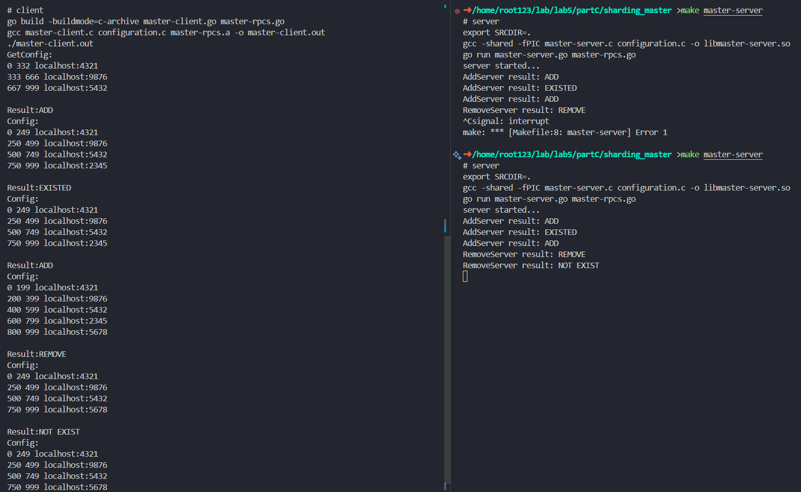
可以看出，测试结果和预期一致。

测试代码如下（`master-client.c`）：
```C
int main()
{
    char *master_ip = "localhost:1234";
    Config_IP(master_ip);

    char *config_str, *res;
    config_str = GetConfig();
    printf("GetConfig:\n%s\n", config_str);

    res = AddServer("localhost:2345");
    config_str = GetConfig();
    printf("Result:%s\nConfig:\n%s\n", res, config_str);

    res = AddServer("localhost:2345");
    config_str = GetConfig();
    printf("Result:%s\nConfig:\n%s\n", res, config_str);

    res = AddServer("localhost:5678");
    config_str = GetConfig();
    printf("Result:%s\nConfig:\n%s\n", res, config_str);

    res = RemoveServer("localhost:2345");
    config_str = GetConfig();
    printf("Result:%s\nConfig:\n%s\n", res, config_str);

    res = RemoveServer("localhost:2345");
    config_str = GetConfig();
    printf("Result:%s\nConfig:\n%s\n", res, config_str);
}
```

<div STYLE="page-break-after: always;"></div>


## KV Shuffling
难度最高的一个实验，光是框架和接口设计就花费了我几个小时，编码和调试加起来更是花费了我近10小时的时间。这个实验的难度在于，完全没有示例代码，所有框架和接口都需要自己摸索，调试还极为复杂（往往要开5、6个终端联调），而且需要同时考虑多个服务器以及多个客户端的并发问题。

### Exercise 5
由于这个任务比较复杂，代码量极多，因此此处只会贴出C文件的核心代码。go文件的代码只是简单的RPC接口实现，不再贴出，完整代码请参考[code/partC/kv_shuffling](./code/partC/kv_shuffling)。

#### 任务分配
我将该任务分成四个模块。约定好接口后，四个模块互相独立、互不影响，可以并行开发。
- **master-server**：负责管理kv存储服务器的配置文件和kv对的分配。（KV_MS_Service文件夹）
- **kv-server**：负责存储和传输kv对。（KV_DB_Service文件夹）
- **kv-client**：向kv存储服务器发送请求，生成、修改和获取数据。（Client文件夹）
- **manager**：负责与**master-server**及**kv-server**通讯，管理kv存储服务器的增减，以及kv对的实际分配。KV Shuffling的核心逻辑在这里实现。实际实现中，为了方便调试，manager也集成了**kv-client**的功能。（Manager文件夹）

完整的文件结构如图所示：
```
kv_shuffling
├── Client
│   ├── kv-client.c
│   ├── kv-client.go
│   ├── kv-rpcs.a
│   └── kv-rpcs.h
├── KV_DB_Service
│   ├── kv-server.c
│   ├── kv-server.go
│   ├── kv-server.h
│   └── libkv-server.so
├── KV_MS_Service
│   ├── libmaster-server.so
│   ├── master-server.c
│   ├── master-server.go
│   └── master-server.h
├── Manager
│   ├── manager.c
│   ├── master-client.c
│   ├── master-client.go
│   ├── master-client.h
│   ├── master-rpcs.a
│   └── master-rpcs.h
├── util
│   ├── kv-rpcs.go
│   └── master-rpcs.go
└── util_c
    ├── configuration.c
    ├── configuration.h
    ├── hash-table.c
    └── hash-table.h
```

#### master-server
首先我们可以复用Exercise 3/4里的**master-server**。只需修改少量go代码和C代码，完成对接。

#### kv-client
继续复用Exercise 1里的**kv-client**。只需修改少量go代码和C代码，补充`GetConfig`, `deserialize_config`, `getServerAddress`接口即可。
```C
char *get_address_for_key(char *key)
{
    static char *master_addr = ":1234";
    Config_IP(master_addr);
    char *config_str = GetConfig();
    Configuration *config = deserialize_config(config_str);
    char *ret = getServerAddress(config, key);
    free(config);
    free(config_str);
    return ret;
}
```

#### kv-server
然后，我们用go语言实现一个可以自由增减kv存储服务器（用协程实现）的kv存储系统**kv-server**。
```go
type KV_DB_Service struct {
	addr string
}

type Server struct {
	listener net.Listener
	rpcs     *rpc.Server
}

func NewServer(addr string) (*Server, error) {
	service := &KV_DB_Service{addr: addr}
	rpcs := rpc.NewServer()
	rpcs.Register(service)
	l, e := net.Listen("tcp", addr)
	if e != nil {
		return nil, e
	}
	return &Server{listener: l, rpcs: rpcs}, nil
}

func (s *Server) Serve() {
	for {
		conn, err := s.listener.Accept()
		if err == nil {
			go s.rpcs.ServeConn(conn)
		} else {
			break
		}
	}
	fmt.Println("\tServer on", s.listener.Addr().String(), "finished")
}

func (s *Server) Close() error {
	return s.listener.Close()
}

func main() {
	cmdChan := make(chan string)
	servers := make(map[string]*Server)
	var mu sync.Mutex
	fmt.Println("Enter command (ADD/REMOVE) and server address (e.g., ADD localhost:1234): ")
	go func() {
		reader := bufio.NewReader(os.Stdin)
		for {
			cmd, _ := reader.ReadString('\n')
			cmd = strings.TrimSpace(cmd)
			cmdChan <- cmd
		}
	}()

	for cmd := range cmdChan {
		parts := strings.SplitN(cmd, " ", 2)
		if len(parts) != 2 {
			fmt.Println("\tInvalid command")
			continue
		}

		action, addr := parts[0], parts[1]

		switch action {
		case "ADD":
			server, err := NewServer(addr)
			if err != nil {
				log.Println("\tFailed to start server on", addr, ":", err)
				continue
			}
			mu.Lock()
			servers[addr] = server
			mu.Unlock()
			go server.Serve()
			fmt.Println("\tServer started on", addr)

		case "REMOVE":
			mu.Lock()
			server, ok := servers[addr]
			mu.Unlock()
			if ok {
				server.Close()
				mu.Lock()
				delete(servers, addr)
				mu.Unlock()
				fmt.Println("\tServer on", addr, "stopped")
			} else {
				fmt.Println("\tNo server running on", addr)
			}

		default:
			fmt.Println("\tUnknown command:", action)
		}
	}
}
```

并补充两个接口：`delete_kv_range`和`get_all_kv`，用于向manager传输kv对。
```C
// 将hash值在[l,r]范围的键值对序列化返回并清空
char *delete_kv_range(int l, int r)
{
    char *res = malloc(sizeof(char) * BUFFER_SIZE * TABLE_SIZE);
    *res = '\0';
    char *tmp = malloc(sizeof(char) * BUFFER_SIZE);
    for (int i = l; i <= r; i++)
    {
        pthread_rwlock_wrlock(&rwlock[i]);
        MapNode *current = hashTable[i];
        while (current)
        {
            sprintf(tmp, "%s\t%s\n", current->key, current->value);
            strcat(res, tmp);
            MapNode *prev = current;
            current = current->next;
            free(prev);
        }
        hashTable[i] = NULL;
        pthread_rwlock_unlock(&rwlock[i]);
    }
    free(tmp);
    return res;
}

// 将所有键值对序列化返回
char *get_all_kv()
{
    char *res = malloc(sizeof(char) * BUFFER_SIZE * TABLE_SIZE);
    *res = '\0';
    char *tmp = malloc(sizeof(char) * BUFFER_SIZE);
    for (int i = 0; i < TABLE_SIZE; i++)
    {
        pthread_rwlock_rdlock(&rwlock[i]);
        MapNode *current = hashTable[i];
        while (current)
        {
            sprintf(tmp, "%s\t%s\n", current->key, current->value);
            strcat(res, tmp);
            current = current->next;
        }
        pthread_rwlock_unlock(&rwlock[i]);
    }
    free(tmp);
    return res;
}
```

我们使用Exercise 1里的示例程序，增加、减少kv存储服务器后，执行结果如下：
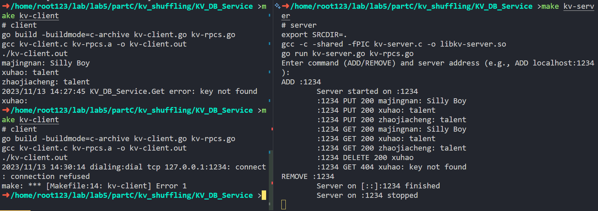

在多个服务器上尝试结果如下：
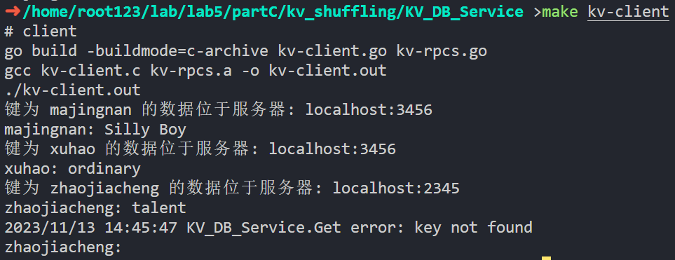

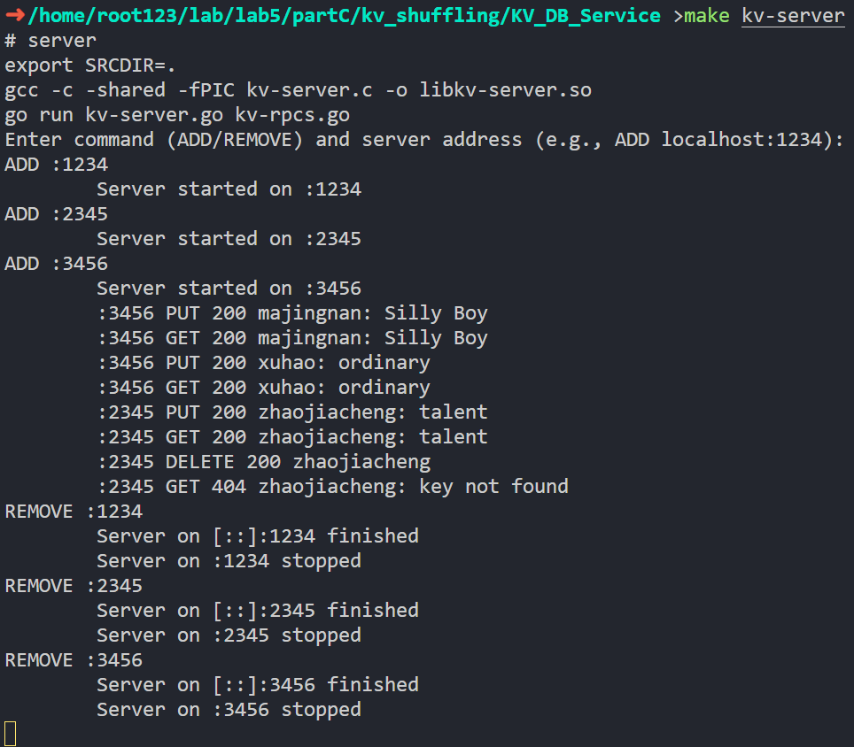

**然而，如果只是用协程实现，那么所有的kv对还是会存储在同一个哈希表中**：

如图，尝试在:2345处获取xuhao/majingnan的信息，成功了。这显然不合理。

因此，在需要改变kv对实际存储位置的测试中，我们还是**需要启动多个进程来作为kv存储服务器**。
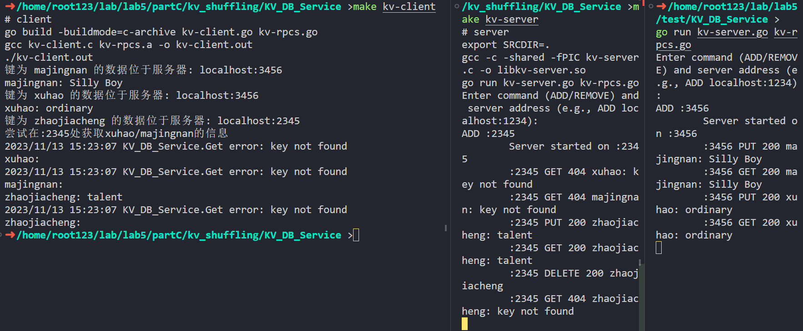
如图，这样就可以保证不同的kv对存储在不同的服务器上。有了这个交互式的kv存储系统，能大大减轻我们的调试负担，我们就可以开始着手实现kv shuffling了。

#### manager
最后终于来到最复杂的manager模块。我们需要实现的功能有：
- 与master-server通讯，管理kv存储服务器的增减
- 与kv-server通讯，管理kv对的实际分配

为了便于调试，我将这个模块设计成交互式的，即manager会等待用户输入指令，然后执行对应的操作。共有`ADD/REMOVE/PUT/GET/DELETE/SHOWALL`这6条指令。

其中，`ADD/REMOVE`用于增加/删除kv存储服务器，`PUT/GET/DELETE`用于生成/获取/删除kv对，`SHOWALL`用于显示所有kv对及其位置。
```C
int main()
{
    char command[BUFFER_SIZE], addr[BUFFER_SIZE], key[BUFFER_SIZE], value[BUFFER_SIZE];
    char *res, *config_str;

    printf("Enter command (ADD/REMOVE/PUT/GET/DELETE/SHOWALL) \n");
    while (1)
    {
        printf("# ");
        scanf("%s", command);

        if (strcmp(command, "ADD") == 0)
        {
            scanf("%s", addr);
            connect_master();
            config_str = GetConfig();
            Configuration *past_config = deserialize_config(config_str);
            free(config_str);

            res = AddServer(addr);
            if (strcmp(res, "EXISTED") == 0)
            {
                printf("\tServer already exist\n");
                free(res);
                continue;
            }
            free(res);

            config_str = GetConfig();
            printf("\tConfig Begin\n%s\tConfig End\n", config_str);
            Configuration *new_config = deserialize_config(config_str);
            free(config_str);

            // KV shuffling
            res = malloc(BUFFER_SIZE * TABLE_SIZE);
            *res = '\0';
            update_config(past_config, new_config, res);

            free(past_config);
            free(new_config);
            free(res);
        }
        else if (strcmp(command, "REMOVE") == 0)
        {
            scanf("%s", addr);
            connect_master();
            config_str = GetConfig();
            Configuration *past_config = deserialize_config(config_str);
            free(config_str);

            res = RemoveServer(addr);
            if (strcmp(res, "NOT EXIST") == 0)
            {
                printf("\tServer not exist\n");
                free(res);
                continue;
            }
            free(res);

            config_str = GetConfig();
            printf("\tConfig Begin\n%s\tConfig End\n", config_str);
            Configuration *new_config = deserialize_config(config_str);
            free(config_str);

            // KV shuffling
            res = malloc(BUFFER_SIZE * TABLE_SIZE);
            *res = '\0';
            for (int i = 0; i < past_config->count; ++i)
            {
                if (strcmp(past_config->shards[i].addr, addr) == 0)
                {
                    Config_IP(addr);
                    strcat(res, Delete_kv_range(past_config->shards[i].l, past_config->shards[i].r)); // addr的区间全部删除
                    continue;
                }
            }
            update_config(past_config, new_config, res);

            free(past_config);
            free(new_config);
            free(res);
        }
        else if (strcmp(command, "SHOWALL") == 0)
        {
            connect_master();
            config_str = GetConfig();
            Configuration *config = deserialize_config(config_str);
            free(config_str);
            for (int i = 0; i < config->count; ++i)
            {
                Config_IP(config->shards[i].addr);
                res = Get_all_kv();
                printf("\t%s Begin\n%s\t%s End\n", config->shards[i].addr, res, config->shards[i].addr);
                free(res);
            }
        }
        else if (strcmp(command, "GET") == 0)
        {
            scanf("%s", key);
            res = get(key);
            printf("\t%s: %s\n", key, res);
            free(res);
        }
        else if (strcmp(command, "PUT") == 0)
        {
            scanf("%s", key);
            scanf("%s", value);
            put(key, value);
            printf("\tPUT OK\n");
        }
        else if (strcmp(command, "DELETE") == 0)
        {
            scanf("%s", key);
            delete (key);
            printf("\tDELETE OK\n");
        }
        else if (strcmp(command, "EXIT") == 0)
        {
            break;
        }
        else
        {
            printf("\tInvalid command\n");
            continue;
        }
    }

    return 0;
}
```

**KV Shuffling核心逻辑**如下：
```C
void update_config(Configuration *past_config, Configuration *new_config, char *res)
{
    for (int i = 0; i < past_config->count; ++i)
    {
        for (int j = 0; j < new_config->count; ++j)
        {
            if (strcmp(past_config->shards[i].addr, new_config->shards[j].addr) == 0)
            {
                Config_IP(past_config->shards[i].addr);

                int pl = past_config->shards[i].l, pr = past_config->shards[i].r, nl = new_config->shards[j].l, nr = new_config->shards[j].r;
                // 度量两个区间的相对关系，将失效的区间的key-value删除
                // 在[pl,pr]而不在[nl,nr]的就是失效的区间，需要将这些区间的key-value删除，并加入res中

                // [pl,pr]和[nl,nr]没有交集
                if (pl > nr || pr < nl)
                {
                    strcat(res, Delete_kv_range(pl, pr));
                }
                // [pl,pr]包含[nl,nr]
                else if (pl <= nl && pr >= nr)
                {
                    strcat(res, Delete_kv_range(pl, nl - 1));
                    strcat(res, Delete_kv_range(nr + 1, pr));
                }
                // [pl,pr]和[nl,nr]有交集，但是不包含
                else if (pl <= nl && pr >= nl)
                {
                    strcat(res, Delete_kv_range(pl, nl - 1));
                }
                else if (pl <= nr && pr >= nr)
                {
                    strcat(res, Delete_kv_range(nr + 1, pr));
                }
            }
        }
    }

    // res的结构为 key \t value \n key \t value \n ...
    // 一一读取，并put到新的区间中
    char *save_ptr, *p = strtok_r(res, "\n", &save_ptr);
    while (p != NULL)
    {
        char *key = strtok(p, "\t");
        char *value = strtok(NULL, "\t");
        put(key, value);
        p = strtok_r(NULL, "\n", &save_ptr);
    }
}
```
通过这个函数，我们可以将失效的区间的key-value删除，并将新的区间的key-value自动分配到对应的服务器中。


#### 测试1. 与master-server通讯，管理kv存储服务器的增减
首先我们开3个分布式存储服务进程，分别绑定2345，3456，4567端口，让master-server绑定在1234端口。
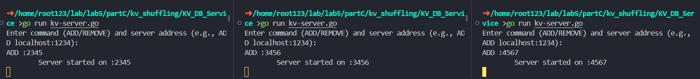

以如图所示键入指令给manager，client按照Exercise1的测试代码运行，master-server和kv-server无需键入指令，直接运行即可。
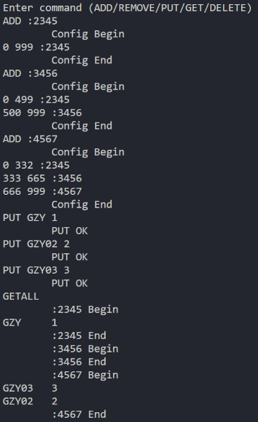

得到的master-server和kv-server的行为如下：
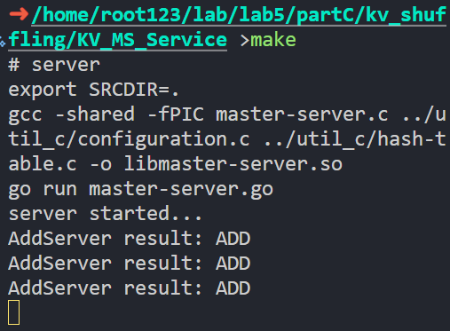
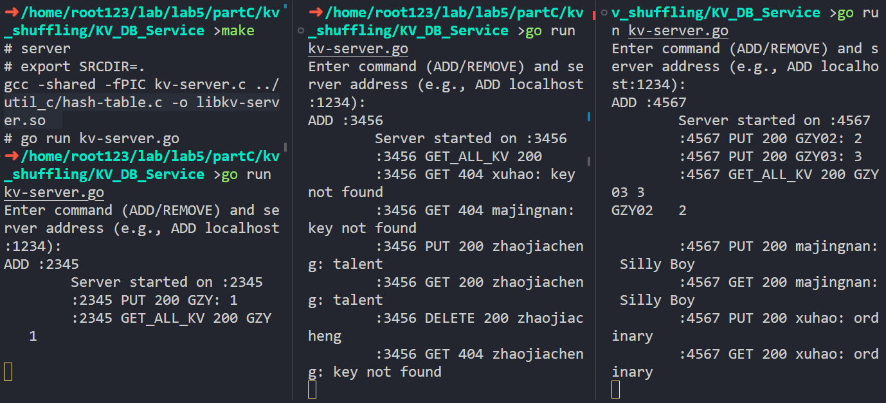

<div STYLE="page-break-after: always;"></div>

#### 测试2. 与kv-server通讯，管理kv对的实际分配
依然开3个分布式存储服务进程，分别绑定2345，3456，4567端口，让master-server绑定在1234端口。

我们PUT一些个键值对，然后观察他们的存储分布情况。将其中一个服务器移除，可以看到，它所保存的kv对被重新分配到其他服务器上了。

manager行为：
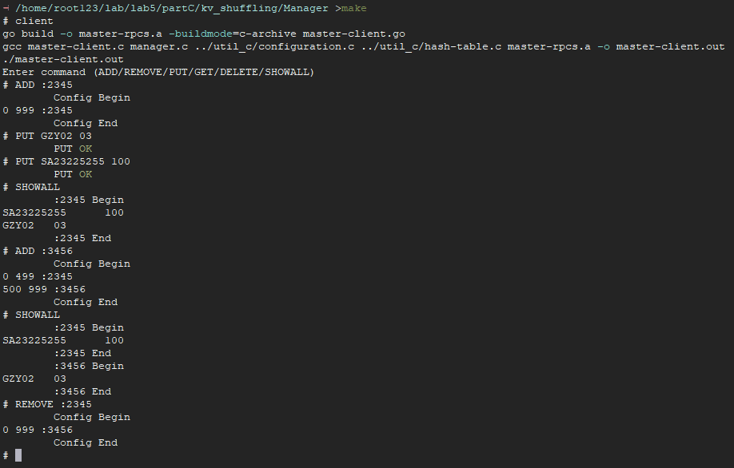
kv-server行为：
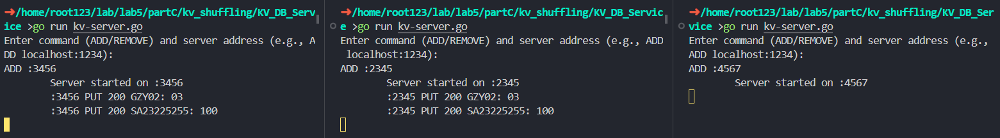
master-server行为：
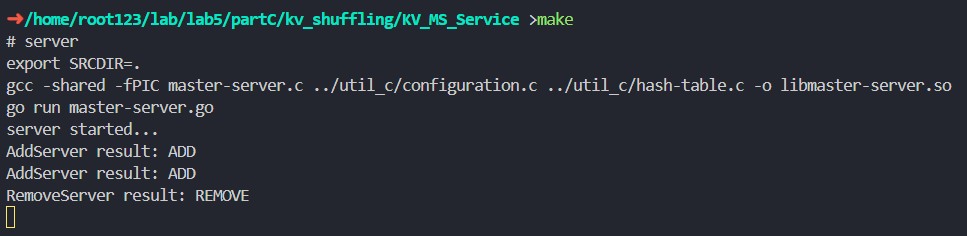

<div STYLE="page-break-after: always;"></div>
# 总结
在做这个实验的过程中，最后一节课华老师说的“这个实验我们不用写一行go代码”一直在我的脑子里回响，让我印象深刻，而我也正是因为这句话入了lab5这个大坑的。然而40h的实验做完后，除了需要学10h的go语言外，lab5可以说没有任何缺点，可以让人深刻领悟到并发编程尤其是多服务端、多客户端编程的魅力~~，并在debug的过程中被折磨疯~~。

这个实验的难度确实很大，但是收获也是最大的，其中Part B&C让人印象深刻：让我们自己设计一个框架，甚至不给示例程序的做法初看确实容易让人崩溃，但是这样的做法确实让我们真正地理解了MapReduce和KV Shuffling的原理，也让我们对go语言和gRPC有了更深刻的认识。正是因为完成实验中最精华的Part B&C需要一定的go语言基础，实验过程中go这座大山便不能被轻易忽视，尤其是其中还涉及了cgo、go语言的包管理等对调试不友好的内容，这也是我花费大量时间的原因。

我认为之后的课程里可以适当增加对go语言的使用，在lab5之前就提前给出go语言的学习资料，以防入门时便被go语言这座大山吓跑，从而错过了这么优秀的实验内容。同时可能还需要补充更多文档，以便下一届同学们能够更好地完成这个实验。毕竟相比于文档详尽的lab0~4，这个实验的说明文档实在是太贫乏了。虽然我理解这个实验考察的主要是设计问题，所以开放给我们自己做，留出了足够多的自由空间，但是这样的做法也让我在实验过程中遇到了很多困难，例如我在Part B的Exercise 3以及Part C的Exercise 3~5的就遇到了非常非常多的问题，最后只能自己摸索出来。如果有更多的文档（例如一个大体的设计思路），我相信我可以更快更好地完成这个实验。

lab0~4也都相当有趣，这一系列实验设置得环环相扣，循序渐进。从C语言的编译过程和linux程序的执行过程开始，到多进程、多线程的并发控制和网络编程的简单小程序实现，再到这次lab5中实现一个较为复杂的分布式系统。不是靠课堂上的说教，而是靠这一系列的实验将工程化C程序设计的理念清晰地印刻在我们心中，让我们对C语言的使用有了更深刻的认识，也让我们对操作系统、网络编程、并发编程有了更深刻的理解。

感谢工程C课程的老师和助教们，为我们带来了这么有意思的实验。这是我5年大学时光中上过的最好的一门专业课。

</br></br></br></br></br></br>

**本人签名**
